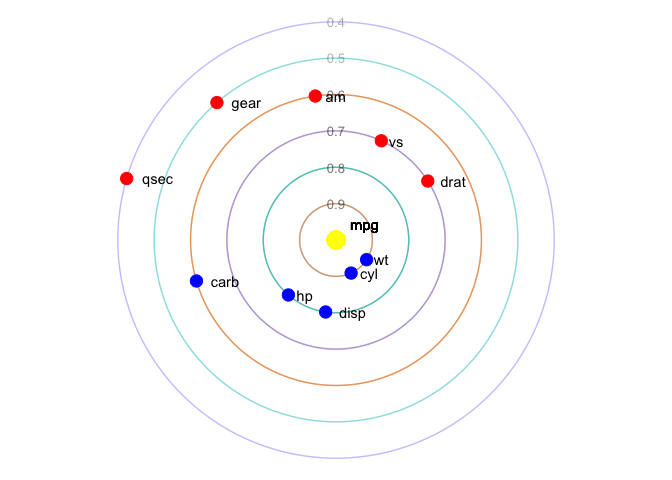
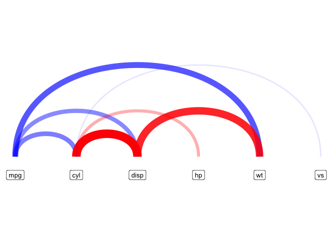
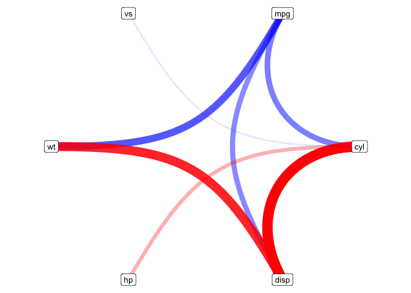
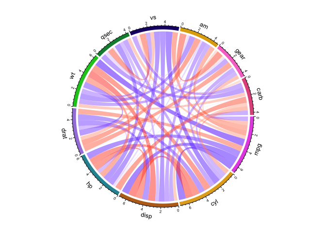
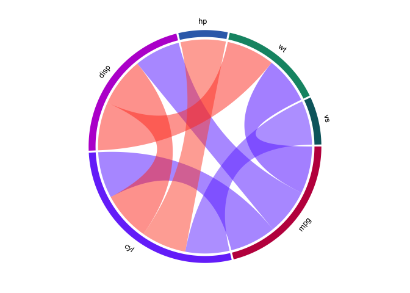

<!-- README.md is generated from README.Rmd. Please edit that file -->

# corrViz

<!-- badges: start -->


<!-- badges: end -->

`corrViz` is an R package designed to help users visualize correlations
between variables in their datasets. With the ever-growing size and
complexity of datasets, it is crucial to have a clear understanding of
the relationships between variables. This package aims to provide an
easy and effective way to explore and visualize these correlations,
making it easier to interpret and communicate results.

This vignette will introduce you to the main features and functions of
the `corrViz` package, guiding you through the process of creating
visually appealing and informative correlation plots. By the end of this
tutorial, you should be able to use `corrViz` to create various types of
correlation visualizations, customize their appearance, and gain
insights into the relationships within your dataset.

Download the development version from
[GitHub](https://github.com/AlanInglis/corrViz) with:

``` r
# install.packages("devtools")
devtools::install_github("AlanInglis/corrViz")
```

You can then load the package with:

``` r
library(corrViz)
#> Registered S3 method overwritten by 'seriation':
#>   method         from 
#>   reorder.hclust gclus
```

# Visualization Methods

The `corrViz` package offers several visualization methods to help you
explore and communicate correlations effectively, with an emphasis on
interactivity. Some of the available methods include:

- Heatmaps
- Networks
- Scatterplot matrices
- Bar plots
- Chord diagrams

# Heat map

``` r
corrHeatmap(data = mtcars,
            method = 'pearson',
            display = 'all',
            reorder = TRUE)
#> PhantomJS not found. You can install it with webshot::install_phantomjs(). If it is installed, please make sure the phantomjs executable can be found via the PATH variable.
```

<div id="htmlwidget-44886d03c72a3f0138e8" style="width:100%;height:100%;" class="plotly html-widget"></div>
<script type="application/json" data-for="htmlwidget-44886d03c72a3f0138e8">{"x":{"data":[{"x":[1,2,3,4,5,6,7,8,9,10,11],"y":[1,2,3,4,5,6,7,8,9,10,11],"z":[[0.0322033898305084,0.0892655367231639,0.17683615819209,0.0819209039548023,0.168361581920904,0.585310734463277,0.606779661016949,0.738983050847458,0.865536723163842,0.911299435028249,null],[0.156497175141243,0.245197740112994,0.391525423728814,0.0903954802259887,0.119774011299435,0.36045197740113,0.370056497175141,0.54180790960452,0.727118644067797,null,0.911299435028249],[0.00903954802259888,0.0112994350282486,0,0.0519774011299435,0.17909604519774,0.829378531073446,0.761581920903955,0.875141242937853,null,0.727118644067797,0.865536723163842],[0.0949152542372882,0.0892655367231639,0.088135593220339,0.236723163841808,0.438983050847458,0.893220338983051,0.885875706214689,null,0.875141242937853,0.54180790960452,0.738983050847458],[0.211864406779661,0.176271186440678,0.161016949152542,0.419209039548023,0.645197740112994,0.938983050847458,null,0.885875706214689,0.761581920903955,0.370056497175141,0.606779661016949],[0.194915254237288,0.156497175141243,0.0994350282485876,0.353107344632768,0.52316384180791,null,0.938983050847458,0.893220338983051,0.829378531073446,0.36045197740113,0.585310734463277],[0.788135593220339,0.713559322033898,0.732203389830508,0.914124293785311,null,0.52316384180791,0.645197740112994,0.438983050847458,0.17909604519774,0.119774011299435,0.168361581920904],[0.96045197740113,0.93728813559322,0.86271186440678,null,0.914124293785311,0.353107344632768,0.419209039548023,0.236723163841808,0.0519774011299435,0.0903954802259887,0.0819209039548023],[0.932203389830508,0.992090395480226,null,0.86271186440678,0.732203389830508,0.0994350282485876,0.161016949152542,0.088135593220339,0,0.391525423728814,0.17683615819209],[1,null,0.992090395480226,0.93728813559322,0.713559322033898,0.156497175141243,0.176271186440678,0.0892655367231639,0.0112994350282486,0.245197740112994,0.0892655367231639],[null,1,0.932203389830508,0.96045197740113,0.788135593220339,0.194915254237288,0.211864406779661,0.0949152542372882,0.00903954802259888,0.156497175141243,0.0322033898305084]],"text":[["Var1: cyl<br />Var2: vs<br />correlation: -0.811","Var1: disp<br />Var2: vs<br />correlation: -0.710","Var1: wt<br />Var2: vs<br />correlation: -0.555","Var1: hp<br />Var2: vs<br />correlation: -0.723","Var1: carb<br />Var2: vs<br />correlation: -0.570","Var1: am<br />Var2: vs<br />correlation:  0.168","Var1: gear<br />Var2: vs<br />correlation:  0.206","Var1: drat<br />Var2: vs<br />correlation:  0.440","Var1: mpg<br />Var2: vs<br />correlation:  0.664","Var1: qsec<br />Var2: vs<br />correlation:  0.745","Var1: vs<br />Var2: vs<br />correlation:     NA"],["Var1: cyl<br />Var2: qsec<br />correlation: -0.591","Var1: disp<br />Var2: qsec<br />correlation: -0.434","Var1: wt<br />Var2: qsec<br />correlation: -0.175","Var1: hp<br />Var2: qsec<br />correlation: -0.708","Var1: carb<br />Var2: qsec<br />correlation: -0.656","Var1: am<br />Var2: qsec<br />correlation: -0.230","Var1: gear<br />Var2: qsec<br />correlation: -0.213","Var1: drat<br />Var2: qsec<br />correlation:  0.091","Var1: mpg<br />Var2: qsec<br />correlation:  0.419","Var1: qsec<br />Var2: qsec<br />correlation:     NA","Var1: vs<br />Var2: qsec<br />correlation:  0.745"],["Var1: cyl<br />Var2: mpg<br />correlation: -0.852","Var1: disp<br />Var2: mpg<br />correlation: -0.848","Var1: wt<br />Var2: mpg<br />correlation: -0.868","Var1: hp<br />Var2: mpg<br />correlation: -0.776","Var1: carb<br />Var2: mpg<br />correlation: -0.551","Var1: am<br />Var2: mpg<br />correlation:  0.600","Var1: gear<br />Var2: mpg<br />correlation:  0.480","Var1: drat<br />Var2: mpg<br />correlation:  0.681","Var1: mpg<br />Var2: mpg<br />correlation:     NA","Var1: qsec<br />Var2: mpg<br />correlation:  0.419","Var1: vs<br />Var2: mpg<br />correlation:  0.664"],["Var1: cyl<br />Var2: drat<br />correlation: -0.700","Var1: disp<br />Var2: drat<br />correlation: -0.710","Var1: wt<br />Var2: drat<br />correlation: -0.712","Var1: hp<br />Var2: drat<br />correlation: -0.449","Var1: carb<br />Var2: drat<br />correlation: -0.091","Var1: am<br />Var2: drat<br />correlation:  0.713","Var1: gear<br />Var2: drat<br />correlation:  0.700","Var1: drat<br />Var2: drat<br />correlation:     NA","Var1: mpg<br />Var2: drat<br />correlation:  0.681","Var1: qsec<br />Var2: drat<br />correlation:  0.091","Var1: vs<br />Var2: drat<br />correlation:  0.440"],["Var1: cyl<br />Var2: gear<br />correlation: -0.493","Var1: disp<br />Var2: gear<br />correlation: -0.556","Var1: wt<br />Var2: gear<br />correlation: -0.583","Var1: hp<br />Var2: gear<br />correlation: -0.126","Var1: carb<br />Var2: gear<br />correlation:  0.274","Var1: am<br />Var2: gear<br />correlation:  0.794","Var1: gear<br />Var2: gear<br />correlation:     NA","Var1: drat<br />Var2: gear<br />correlation:  0.700","Var1: mpg<br />Var2: gear<br />correlation:  0.480","Var1: qsec<br />Var2: gear<br />correlation: -0.213","Var1: vs<br />Var2: gear<br />correlation:  0.206"],["Var1: cyl<br />Var2: am<br />correlation: -0.523","Var1: disp<br />Var2: am<br />correlation: -0.591","Var1: wt<br />Var2: am<br />correlation: -0.692","Var1: hp<br />Var2: am<br />correlation: -0.243","Var1: carb<br />Var2: am<br />correlation:  0.058","Var1: am<br />Var2: am<br />correlation:     NA","Var1: gear<br />Var2: am<br />correlation:  0.794","Var1: drat<br />Var2: am<br />correlation:  0.713","Var1: mpg<br />Var2: am<br />correlation:  0.600","Var1: qsec<br />Var2: am<br />correlation: -0.230","Var1: vs<br />Var2: am<br />correlation:  0.168"],["Var1: cyl<br />Var2: carb<br />correlation:  0.527","Var1: disp<br />Var2: carb<br />correlation:  0.395","Var1: wt<br />Var2: carb<br />correlation:  0.428","Var1: hp<br />Var2: carb<br />correlation:  0.750","Var1: carb<br />Var2: carb<br />correlation:     NA","Var1: am<br />Var2: carb<br />correlation:  0.058","Var1: gear<br />Var2: carb<br />correlation:  0.274","Var1: drat<br />Var2: carb<br />correlation: -0.091","Var1: mpg<br />Var2: carb<br />correlation: -0.551","Var1: qsec<br />Var2: carb<br />correlation: -0.656","Var1: vs<br />Var2: carb<br />correlation: -0.570"],["Var1: cyl<br />Var2: hp<br />correlation:  0.832","Var1: disp<br />Var2: hp<br />correlation:  0.791","Var1: wt<br />Var2: hp<br />correlation:  0.659","Var1: hp<br />Var2: hp<br />correlation:     NA","Var1: carb<br />Var2: hp<br />correlation:  0.750","Var1: am<br />Var2: hp<br />correlation: -0.243","Var1: gear<br />Var2: hp<br />correlation: -0.126","Var1: drat<br />Var2: hp<br />correlation: -0.449","Var1: mpg<br />Var2: hp<br />correlation: -0.776","Var1: qsec<br />Var2: hp<br />correlation: -0.708","Var1: vs<br />Var2: hp<br />correlation: -0.723"],["Var1: cyl<br />Var2: wt<br />correlation:  0.782","Var1: disp<br />Var2: wt<br />correlation:  0.888","Var1: wt<br />Var2: wt<br />correlation:     NA","Var1: hp<br />Var2: wt<br />correlation:  0.659","Var1: carb<br />Var2: wt<br />correlation:  0.428","Var1: am<br />Var2: wt<br />correlation: -0.692","Var1: gear<br />Var2: wt<br />correlation: -0.583","Var1: drat<br />Var2: wt<br />correlation: -0.712","Var1: mpg<br />Var2: wt<br />correlation: -0.868","Var1: qsec<br />Var2: wt<br />correlation: -0.175","Var1: vs<br />Var2: wt<br />correlation: -0.555"],["Var1: cyl<br />Var2: disp<br />correlation:  0.902","Var1: disp<br />Var2: disp<br />correlation:     NA","Var1: wt<br />Var2: disp<br />correlation:  0.888","Var1: hp<br />Var2: disp<br />correlation:  0.791","Var1: carb<br />Var2: disp<br />correlation:  0.395","Var1: am<br />Var2: disp<br />correlation: -0.591","Var1: gear<br />Var2: disp<br />correlation: -0.556","Var1: drat<br />Var2: disp<br />correlation: -0.710","Var1: mpg<br />Var2: disp<br />correlation: -0.848","Var1: qsec<br />Var2: disp<br />correlation: -0.434","Var1: vs<br />Var2: disp<br />correlation: -0.710"],["Var1: cyl<br />Var2: cyl<br />correlation:     NA","Var1: disp<br />Var2: cyl<br />correlation:  0.902","Var1: wt<br />Var2: cyl<br />correlation:  0.782","Var1: hp<br />Var2: cyl<br />correlation:  0.832","Var1: carb<br />Var2: cyl<br />correlation:  0.527","Var1: am<br />Var2: cyl<br />correlation: -0.523","Var1: gear<br />Var2: cyl<br />correlation: -0.493","Var1: drat<br />Var2: cyl<br />correlation: -0.700","Var1: mpg<br />Var2: cyl<br />correlation: -0.852","Var1: qsec<br />Var2: cyl<br />correlation: -0.591","Var1: vs<br />Var2: cyl<br />correlation: -0.811"]],"colorscale":[[0,"#4A5DA9"],[0.00903954802259888,"#4F61A9"],[0.0112994350282486,"#5062AA"],[0.0322033898305084,"#5A69AD"],[0.0519774011299435,"#6371AF"],[0.0819209039548023,"#717CB4"],[0.088135593220339,"#737EB6"],[0.0892655367231639,"#737EB6"],[0.0903954802259887,"#747FB6"],[0.0949152542372882,"#7580B7"],[0.0994350282485876,"#7782B7"],[0.119774011299435,"#8089BA"],[0.156497175141243,"#8E96BF"],[0.161016949152542,"#9098C0"],[0.168361581920904,"#929AC2"],[0.176271186440678,"#959CC3"],[0.17683615819209,"#959CC3"],[0.17909604519774,"#969DC3"],[0.194915254237288,"#9CA2C6"],[0.211864406779661,"#A2A7C8"],[0.236723163841808,"#AAAFCC"],[0.245197740112994,"#ADB1CD"],[0.353107344632768,"#CCCDD9"],[0.36045197740113,"#CDCFDA"],[0.370056497175141,"#D0D1DB"],[0.391525423728814,"#D5D6DD"],[0.419209039548023,"#DADBDF"],[0.438983050847458,"#DDDEE0"],[0.52316384180791,"#E2E0E0"],[0.54180790960452,"#E1DDDD"],[0.585310734463277,"#DED4D6"],[0.606779661016949,"#DCD0D2"],[0.645197740112994,"#D9C6C9"],[0.713559322033898,"#D2B1B7"],[0.727118644067797,"#D1ACB2"],[0.732203389830508,"#D0AAB1"],[0.738983050847458,"#CFA8AF"],[0.761581920903955,"#CCA0A8"],[0.788135593220339,"#C896A0"],[0.829378531073446,"#C28691"],[0.86271186440678,"#BC7886"],[0.865536723163842,"#BB7785"],[0.875141242937853,"#B97381"],[0.885875706214689,"#B76E7D"],[0.893220338983051,"#B56B7B"],[0.911299435028249,"#B26374"],[0.914124293785311,"#B16273"],[0.932203389830508,"#AD596C"],[0.93728813559322,"#AC576A"],[0.938983050847458,"#AC566A"],[0.96045197740113,"#A74C61"],[0.992090395480226,"#9F3B55"],[1,"#9D3651"]],"type":"heatmap","showscale":false,"autocolorscale":false,"showlegend":false,"xaxis":"x","yaxis":"y","hoverinfo":"text","frame":null},{"x":[1],"y":[1],"name":"01_2fa710d25d01098f644b7748d8112247","type":"scatter","mode":"markers","opacity":0,"hoverinfo":"skip","showlegend":false,"marker":{"color":[0,1],"colorscale":[[0,"#023FA5"],[0.00334448160535117,"#0C41A5"],[0.00668896321070234,"#1442A4"],[0.0100334448160535,"#1A44A4"],[0.0133779264214047,"#1F46A4"],[0.0167224080267558,"#2347A4"],[0.020066889632107,"#2749A4"],[0.0234113712374582,"#2A4AA4"],[0.0267558528428093,"#2E4CA4"],[0.0301003344481605,"#314DA4"],[0.0334448160535117,"#344FA4"],[0.0367892976588629,"#3650A5"],[0.040133779264214,"#3952A5"],[0.0434782608695652,"#3B53A5"],[0.0468227424749164,"#3E55A6"],[0.0501672240802676,"#4056A6"],[0.0535117056856187,"#4257A7"],[0.0568561872909699,"#4459A7"],[0.0602006688963211,"#465BA8"],[0.0635451505016723,"#485CA8"],[0.0668896321070234,"#4A5DA9"],[0.0702341137123746,"#4D5FA9"],[0.0735785953177258,"#4E60A9"],[0.0769230769230769,"#5062AA"],[0.0802675585284281,"#5264AA"],[0.0836120401337793,"#5465AB"],[0.0869565217391304,"#5666AB"],[0.0903010033444816,"#5868AC"],[0.0936454849498328,"#5969AD"],[0.0969899665551839,"#5B6AAD"],[0.100334448160535,"#5D6CAE"],[0.103678929765886,"#5F6DAE"],[0.107023411371237,"#616FAF"],[0.110367892976589,"#6371AF"],[0.11371237458194,"#6472B0"],[0.117056856187291,"#6673B0"],[0.120401337792642,"#6875B1"],[0.123745819397993,"#6976B2"],[0.127090301003345,"#6B77B2"],[0.130434782608696,"#6D79B3"],[0.133779264214047,"#6E7AB3"],[0.137123745819398,"#707BB4"],[0.140468227424749,"#727DB5"],[0.1438127090301,"#737EB5"],[0.147157190635452,"#747FB6"],[0.150501672240803,"#7681B7"],[0.153846153846154,"#7782B7"],[0.157190635451505,"#7983B8"],[0.160535117056856,"#7A85B8"],[0.163879598662207,"#7C86B8"],[0.167224080267559,"#7E87B9"],[0.17056856187291,"#7F89BA"],[0.173913043478261,"#818ABA"],[0.177257525083612,"#828BBB"],[0.180602006688963,"#848DBC"],[0.183946488294314,"#858EBC"],[0.187290969899666,"#878FBD"],[0.190635451505017,"#8890BE"],[0.193979933110368,"#8A92BE"],[0.197324414715719,"#8B93BF"],[0.20066889632107,"#8C94BF"],[0.204013377926421,"#8E96BF"],[0.207357859531773,"#8F97C0"],[0.210702341137124,"#9098C1"],[0.214046822742475,"#929AC1"],[0.217391304347826,"#939BC2"],[0.220735785953177,"#949CC3"],[0.224080267558528,"#969DC3"],[0.22742474916388,"#989EC4"],[0.230769230769231,"#999FC5"],[0.234113712374582,"#9BA1C5"],[0.237458193979933,"#9CA2C6"],[0.240802675585284,"#9DA3C6"],[0.244147157190635,"#9FA5C6"],[0.247491638795987,"#A0A6C7"],[0.250836120401338,"#A1A6C8"],[0.254180602006689,"#A2A8C8"],[0.25752508361204,"#A3A9C9"],[0.260869565217391,"#A4AACA"],[0.264214046822742,"#A6ABCA"],[0.267558528428094,"#A7ACCA"],[0.270903010033445,"#A8ADCB"],[0.274247491638796,"#AAAECB"],[0.277591973244147,"#ABAFCC"],[0.280936454849498,"#ACB0CD"],[0.284280936454849,"#AEB2CD"],[0.287625418060201,"#AFB3CD"],[0.290969899665552,"#B0B4CE"],[0.294314381270903,"#B1B5CE"],[0.297658862876254,"#B2B6CF"],[0.301003344481605,"#B3B7D0"],[0.304347826086957,"#B5B8D0"],[0.307692307692308,"#B6B9D0"],[0.311036789297659,"#B7BAD1"],[0.31438127090301,"#B8BBD1"],[0.317725752508361,"#B9BCD1"],[0.321070234113712,"#BABDD2"],[0.324414715719064,"#BBBED2"],[0.327759197324415,"#BCBFD3"],[0.331103678929766,"#BDC0D4"],[0.334448160535117,"#BEC1D4"],[0.337792642140468,"#BFC2D4"],[0.341137123745819,"#C0C3D5"],[0.344481605351171,"#C1C4D5"],[0.347826086956522,"#C3C5D5"],[0.351170568561873,"#C4C6D6"],[0.354515050167224,"#C5C7D6"],[0.357859531772575,"#C6C8D7"],[0.361204013377926,"#C7C9D8"],[0.364548494983278,"#C8CAD8"],[0.367892976588629,"#C9CBD8"],[0.37123745819398,"#CACCD9"],[0.374581939799331,"#CBCCD9"],[0.377926421404682,"#CCCDD9"],[0.381270903010033,"#CCCEDA"],[0.384615384615385,"#CDCFDA"],[0.387959866220736,"#CED0DA"],[0.391304347826087,"#CFD0DB"],[0.394648829431438,"#D0D1DB"],[0.397993311036789,"#D1D2DB"],[0.40133779264214,"#D2D3DC"],[0.404682274247492,"#D3D4DC"],[0.408026755852843,"#D4D5DC"],[0.411371237458194,"#D4D5DD"],[0.414715719063545,"#D5D6DD"],[0.418060200668896,"#D6D7DD"],[0.421404682274247,"#D6D7DE"],[0.424749163879599,"#D7D8DE"],[0.42809364548495,"#D8D9DE"],[0.431438127090301,"#D8D9DF"],[0.434782608695652,"#D9DADF"],[0.438127090301003,"#DADBDF"],[0.441471571906354,"#DADBE0"],[0.444816053511706,"#DBDCE0"],[0.448160535117057,"#DCDDE0"],[0.451505016722408,"#DCDDE0"],[0.454849498327759,"#DDDEE0"],[0.45819397993311,"#DEDEE0"],[0.461538461538462,"#DEDFE1"],[0.464882943143813,"#DFDFE1"],[0.468227424749164,"#DFDFE1"],[0.471571906354515,"#E0E0E1"],[0.474916387959866,"#E0E0E1"],[0.478260869565217,"#E0E0E1"],[0.481605351170569,"#E1E1E2"],[0.48494983277592,"#E1E1E2"],[0.488294314381271,"#E1E1E2"],[0.491638795986622,"#E2E2E2"],[0.494983277591973,"#E2E2E2"],[0.498327759197324,"#E2E2E2"],[0.501672240802676,"#E2E2E2"],[0.505016722408027,"#E2E2E2"],[0.508361204013378,"#E2E2E2"],[0.511705685618729,"#E2E1E1"],[0.51505016722408,"#E2E1E1"],[0.518394648829431,"#E2E1E1"],[0.521739130434783,"#E2E0E0"],[0.525083612040134,"#E2E0E0"],[0.528428093645485,"#E2E0E0"],[0.531772575250836,"#E1DFDF"],[0.535117056856187,"#E1DFDF"],[0.538461538461538,"#E1DEDE"],[0.54180602006689,"#E1DEDE"],[0.545150501672241,"#E1DDDD"],[0.548494983277592,"#E1DCDD"],[0.551839464882943,"#E0DCDC"],[0.555183946488294,"#E0DBDC"],[0.558528428093645,"#E0DADB"],[0.561872909698997,"#E0DADB"],[0.565217391304348,"#E0D9DA"],[0.568561872909699,"#E0D8D9"],[0.57190635451505,"#DFD7D9"],[0.575250836120401,"#DFD6D8"],[0.578595317725752,"#DFD5D7"],[0.581939799331104,"#DED5D7"],[0.585284280936455,"#DED4D6"],[0.588628762541806,"#DED3D5"],[0.591973244147157,"#DDD2D4"],[0.595317725752508,"#DDD1D3"],[0.598662207357859,"#DDD0D2"],[0.602006688963211,"#DCD0D2"],[0.605351170568562,"#DCCFD1"],[0.608695652173913,"#DCCED0"],[0.612040133779264,"#DBCDCF"],[0.615384615384615,"#DBCCCE"],[0.618729096989967,"#DBCBCD"],[0.622073578595318,"#DBCACD"],[0.625418060200669,"#DBC9CC"],[0.62876254180602,"#DBC8CB"],[0.632107023411371,"#DAC7CA"],[0.635451505016722,"#D9C6C9"],[0.638795986622074,"#D9C5C8"],[0.642140468227425,"#D8C4C7"],[0.645484949832776,"#D8C2C6"],[0.648829431438127,"#D8C1C5"],[0.652173913043478,"#D7C0C4"],[0.655518394648829,"#D7BFC3"],[0.658862876254181,"#D7BEC2"],[0.662207357859532,"#D6BDC1"],[0.665551839464883,"#D6BCC0"],[0.668896321070234,"#D6BBBF"],[0.672240802675585,"#D5BABE"],[0.675585284280936,"#D5B8BD"],[0.678929765886288,"#D5B7BC"],[0.682274247491639,"#D4B6BB"],[0.68561872909699,"#D4B5BA"],[0.688963210702341,"#D4B4B9"],[0.692307692307692,"#D3B3B8"],[0.695652173913043,"#D2B2B7"],[0.698996655518395,"#D2B0B6"],[0.702341137123746,"#D1AFB5"],[0.705685618729097,"#D1AEB4"],[0.709030100334448,"#D1ACB2"],[0.712374581939799,"#D0ABB1"],[0.71571906354515,"#CFAAB0"],[0.719063545150502,"#CFA8AF"],[0.722408026755853,"#CEA7AE"],[0.725752508361204,"#CEA6AD"],[0.729096989966555,"#CEA4AB"],[0.732441471571906,"#CDA3AA"],[0.735785953177257,"#CCA2A9"],[0.739130434782609,"#CCA0A8"],[0.74247491638796,"#CB9FA7"],[0.745819397993311,"#CB9EA6"],[0.749163879598662,"#CB9CA4"],[0.752508361204013,"#CA9BA4"],[0.755852842809364,"#C99AA3"],[0.759197324414716,"#C998A1"],[0.762541806020067,"#C897A0"],[0.765886287625418,"#C7959F"],[0.769230769230769,"#C7939D"],[0.77257525083612,"#C7929C"],[0.775919732441472,"#C6919B"],[0.779264214046823,"#C68F99"],[0.782608695652174,"#C58E98"],[0.785953177257525,"#C48D97"],[0.789297658862876,"#C48B95"],[0.792642140468227,"#C38A94"],[0.795986622073579,"#C28893"],[0.79933110367893,"#C28691"],[0.802675585284281,"#C18590"],[0.806020066889632,"#C0838F"],[0.809364548494983,"#C0818D"],[0.812709030100334,"#BF808C"],[0.816053511705686,"#BE7F8B"],[0.819397993311037,"#BE7D8A"],[0.822742474916388,"#BD7C88"],[0.826086956521739,"#BC7A87"],[0.82943143812709,"#BC7886"],[0.832775919732441,"#BB7784"],[0.836120401337793,"#BA7583"],[0.839464882943144,"#B97382"],[0.842809364548495,"#B87280"],[0.846153846153846,"#B7707F"],[0.849498327759197,"#B76E7E"],[0.852842809364548,"#B66D7C"],[0.8561872909699,"#B56B7B"],[0.859531772575251,"#B56A7A"],[0.862876254180602,"#B46878"],[0.866220735785953,"#B36677"],[0.869565217391304,"#B36576"],[0.872909698996655,"#B26374"],[0.876254180602007,"#B16172"],[0.879598662207358,"#B06071"],[0.882943143812709,"#AF5E6F"],[0.88628762541806,"#AF5C6E"],[0.889632107023411,"#AE5A6D"],[0.892976588628763,"#AD586B"],[0.896321070234114,"#AC566A"],[0.899665551839465,"#AB5569"],[0.903010033444816,"#AA5367"],[0.906354515050167,"#AA5165"],[0.909698996655518,"#A94F64"],[0.91304347826087,"#A84D62"],[0.916387959866221,"#A74B61"],[0.919732441471572,"#A64A60"],[0.923076923076923,"#A5485E"],[0.926421404682274,"#A4465C"],[0.929765886287625,"#A3445B"],[0.933110367892977,"#A24259"],[0.936454849498328,"#A14058"],[0.939799331103679,"#A03E57"],[0.94314381270903,"#9F3B55"],[0.946488294314381,"#9E3953"],[0.949832775919732,"#9D3752"],[0.953177257525084,"#9C3551"],[0.956521739130435,"#9C324F"],[0.959866220735786,"#9B304E"],[0.963210702341137,"#9A2E4C"],[0.966555183946488,"#992B4B"],[0.969899665551839,"#982949"],[0.973244147157191,"#972648"],[0.976588628762542,"#962346"],[0.979933110367893,"#952045"],[0.983277591973244,"#941D43"],[0.986622073578595,"#921942"],[0.989966555183946,"#911640"],[0.993311036789298,"#90123E"],[0.996655518394649,"#8F0C3D"],[1,"#8E063B"]],"colorbar":{"bgcolor":"rgba(255,255,255,1)","bordercolor":"transparent","borderwidth":0,"thickness":23.04,"title":"Correlation","titlefont":{"color":"rgba(0,0,0,1)","family":"","size":14.6118721461187},"tickmode":"array","ticktext":["-1.0","-0.5","0.0","0.5","1.0"],"tickvals":[0,0.25,0.5,0.75,1],"tickfont":{"color":"rgba(0,0,0,1)","family":"","size":11.689497716895},"ticklen":2,"len":0.5}},"xaxis":"x","yaxis":"y","frame":null}],"layout":{"margin":{"t":26.2283105022831,"r":7.30593607305936,"b":25.5707762557078,"l":34.337899543379},"plot_bgcolor":"rgba(255,255,255,1)","paper_bgcolor":"rgba(255,255,255,1)","font":{"color":"rgba(0,0,0,1)","family":"","size":14.6118721461187},"xaxis":{"domain":[0,1],"automargin":true,"type":"linear","autorange":false,"range":[0.4,11.6],"tickmode":"array","ticktext":["cyl","disp","wt","hp","carb","am","gear","drat","mpg","qsec","vs"],"tickvals":[1,2,3,4,5,6,7,8,9,10,11],"categoryorder":"array","categoryarray":["cyl","disp","wt","hp","carb","am","gear","drat","mpg","qsec","vs"],"nticks":null,"ticks":"outside","tickcolor":"rgba(51,51,51,1)","ticklen":3.65296803652968,"tickwidth":0,"showticklabels":true,"tickfont":{"color":"rgba(77,77,77,1)","family":"","size":11.689497716895},"tickangle":-0,"showline":false,"linecolor":null,"linewidth":0,"showgrid":true,"gridcolor":"rgba(235,235,235,1)","gridwidth":0,"zeroline":false,"anchor":"y","title":{"text":"","font":{"color":"rgba(0,0,0,1)","family":"","size":14.6118721461187}},"hoverformat":".2f"},"yaxis":{"domain":[0,1],"automargin":true,"type":"linear","autorange":false,"range":[0.4,11.6],"tickmode":"array","ticktext":["vs","qsec","mpg","drat","gear","am","carb","hp","wt","disp","cyl"],"tickvals":[1,2,3,4,5,6,7,8,9,10,11],"categoryorder":"array","categoryarray":["vs","qsec","mpg","drat","gear","am","carb","hp","wt","disp","cyl"],"nticks":null,"ticks":"outside","tickcolor":"rgba(51,51,51,1)","ticklen":3.65296803652968,"tickwidth":0,"showticklabels":true,"tickfont":{"color":"rgba(77,77,77,1)","family":"","size":11.689497716895},"tickangle":-0,"showline":false,"linecolor":null,"linewidth":0,"showgrid":true,"gridcolor":"rgba(235,235,235,1)","gridwidth":0,"zeroline":false,"anchor":"x","title":{"text":"","font":{"color":"rgba(0,0,0,1)","family":"","size":14.6118721461187}},"hoverformat":".2f"},"shapes":[{"type":"rect","fillcolor":"transparent","line":{"color":"rgba(51,51,51,1)","width":0,"linetype":"solid"},"yref":"paper","xref":"paper","x0":0,"x1":1,"y0":0,"y1":1}],"showlegend":false,"legend":{"bgcolor":"rgba(255,255,255,1)","bordercolor":"transparent","borderwidth":0,"font":{"color":"rgba(0,0,0,1)","family":"","size":11.689497716895},"title":{"text":"","font":{"color":"rgba(0,0,0,1)","family":"","size":14.6118721461187}}},"hovermode":"closest","barmode":"relative"},"config":{"doubleClick":"reset","modeBarButtonsToAdd":["hoverclosest","hovercompare"],"showSendToCloud":false},"source":"A","attrs":{"26d9382f35dd":{"x":{},"y":{},"fill":{},"type":"heatmap"}},"cur_data":"26d9382f35dd","visdat":{"26d9382f35dd":["function (y) ","x"]},"highlight":{"on":"plotly_click","persistent":false,"dynamic":false,"selectize":false,"opacityDim":0.2,"selected":{"opacity":1},"debounce":0},"shinyEvents":["plotly_hover","plotly_click","plotly_selected","plotly_relayout","plotly_brushed","plotly_brushing","plotly_clickannotation","plotly_doubleclick","plotly_deselect","plotly_afterplot","plotly_sunburstclick"],"base_url":"https://plot.ly"},"evals":[],"jsHooks":[]}</script>
<center>
<caption>
<span id="fig1:fig1">Figure 1: </span>text here.
</caption>
</center>

``` r
corrHeatmap(data = mtcars,
            method = 'pearson',
            display = 'lower',
            reorder = FALSE)
```

<div id="htmlwidget-8823db2f135cff857050" style="width:100%;height:100%;" class="plotly html-widget"></div>
<script type="application/json" data-for="htmlwidget-8823db2f135cff857050">{"x":{"data":[{"x":[1,2,3,4,5,6,7,8,9,10,11],"y":[1,2,3,4,5,6,7,8,9,10,11],"z":[[0.17909604519774,0.788135593220339,0.713559322033898,0.914124293785311,0.438983050847458,0.732203389830508,0.119774011299435,0.168361581920904,0.52316384180791,0.645197740112994,null],[0.761581920903955,0.211864406779661,0.176271186440678,0.419209039548023,0.885875706214689,0.161016949152542,0.370056497175141,0.606779661016949,0.938983050847458,null,null],[0.829378531073446,0.194915254237288,0.156497175141243,0.353107344632768,0.893220338983051,0.0994350282485876,0.36045197740113,0.585310734463277,null,null,null],[0.865536723163842,0.0322033898305084,0.0892655367231639,0.0819209039548023,0.738983050847458,0.17683615819209,0.911299435028249,null,null,null,null],[0.727118644067797,0.156497175141243,0.245197740112994,0.0903954802259887,0.54180790960452,0.391525423728814,null,null,null,null,null],[0,0.932203389830508,0.992090395480226,0.86271186440678,0.088135593220339,null,null,null,null,null,null],[0.875141242937853,0.0949152542372882,0.0892655367231639,0.236723163841808,null,null,null,null,null,null,null],[0.0519774011299435,0.96045197740113,0.93728813559322,null,null,null,null,null,null,null,null],[0.0112994350282486,1,null,null,null,null,null,null,null,null,null],[0.00903954802259888,null,null,null,null,null,null,null,null,null,null],[null,null,null,null,null,null,null,null,null,null,null]],"text":[["Var1: mpg<br />Var2: carb<br />correlation: -0.551","Var1: cyl<br />Var2: carb<br />correlation:  0.527","Var1: disp<br />Var2: carb<br />correlation:  0.395","Var1: hp<br />Var2: carb<br />correlation:  0.750","Var1: drat<br />Var2: carb<br />correlation: -0.091","Var1: wt<br />Var2: carb<br />correlation:  0.428","Var1: qsec<br />Var2: carb<br />correlation: -0.656","Var1: vs<br />Var2: carb<br />correlation: -0.570","Var1: am<br />Var2: carb<br />correlation:  0.058","Var1: gear<br />Var2: carb<br />correlation:  0.274","Var1: carb<br />Var2: carb<br />correlation:     NA"],["Var1: mpg<br />Var2: gear<br />correlation:  0.480","Var1: cyl<br />Var2: gear<br />correlation: -0.493","Var1: disp<br />Var2: gear<br />correlation: -0.556","Var1: hp<br />Var2: gear<br />correlation: -0.126","Var1: drat<br />Var2: gear<br />correlation:  0.700","Var1: wt<br />Var2: gear<br />correlation: -0.583","Var1: qsec<br />Var2: gear<br />correlation: -0.213","Var1: vs<br />Var2: gear<br />correlation:  0.206","Var1: am<br />Var2: gear<br />correlation:  0.794","Var1: gear<br />Var2: gear<br />correlation:     NA","Var1: carb<br />Var2: gear<br />correlation:     NA"],["Var1: mpg<br />Var2: am<br />correlation:  0.600","Var1: cyl<br />Var2: am<br />correlation: -0.523","Var1: disp<br />Var2: am<br />correlation: -0.591","Var1: hp<br />Var2: am<br />correlation: -0.243","Var1: drat<br />Var2: am<br />correlation:  0.713","Var1: wt<br />Var2: am<br />correlation: -0.692","Var1: qsec<br />Var2: am<br />correlation: -0.230","Var1: vs<br />Var2: am<br />correlation:  0.168","Var1: am<br />Var2: am<br />correlation:     NA","Var1: gear<br />Var2: am<br />correlation:     NA","Var1: carb<br />Var2: am<br />correlation:     NA"],["Var1: mpg<br />Var2: vs<br />correlation:  0.664","Var1: cyl<br />Var2: vs<br />correlation: -0.811","Var1: disp<br />Var2: vs<br />correlation: -0.710","Var1: hp<br />Var2: vs<br />correlation: -0.723","Var1: drat<br />Var2: vs<br />correlation:  0.440","Var1: wt<br />Var2: vs<br />correlation: -0.555","Var1: qsec<br />Var2: vs<br />correlation:  0.745","Var1: vs<br />Var2: vs<br />correlation:     NA","Var1: am<br />Var2: vs<br />correlation:     NA","Var1: gear<br />Var2: vs<br />correlation:     NA","Var1: carb<br />Var2: vs<br />correlation:     NA"],["Var1: mpg<br />Var2: qsec<br />correlation:  0.419","Var1: cyl<br />Var2: qsec<br />correlation: -0.591","Var1: disp<br />Var2: qsec<br />correlation: -0.434","Var1: hp<br />Var2: qsec<br />correlation: -0.708","Var1: drat<br />Var2: qsec<br />correlation:  0.091","Var1: wt<br />Var2: qsec<br />correlation: -0.175","Var1: qsec<br />Var2: qsec<br />correlation:     NA","Var1: vs<br />Var2: qsec<br />correlation:     NA","Var1: am<br />Var2: qsec<br />correlation:     NA","Var1: gear<br />Var2: qsec<br />correlation:     NA","Var1: carb<br />Var2: qsec<br />correlation:     NA"],["Var1: mpg<br />Var2: wt<br />correlation: -0.868","Var1: cyl<br />Var2: wt<br />correlation:  0.782","Var1: disp<br />Var2: wt<br />correlation:  0.888","Var1: hp<br />Var2: wt<br />correlation:  0.659","Var1: drat<br />Var2: wt<br />correlation: -0.712","Var1: wt<br />Var2: wt<br />correlation:     NA","Var1: qsec<br />Var2: wt<br />correlation:     NA","Var1: vs<br />Var2: wt<br />correlation:     NA","Var1: am<br />Var2: wt<br />correlation:     NA","Var1: gear<br />Var2: wt<br />correlation:     NA","Var1: carb<br />Var2: wt<br />correlation:     NA"],["Var1: mpg<br />Var2: drat<br />correlation:  0.681","Var1: cyl<br />Var2: drat<br />correlation: -0.700","Var1: disp<br />Var2: drat<br />correlation: -0.710","Var1: hp<br />Var2: drat<br />correlation: -0.449","Var1: drat<br />Var2: drat<br />correlation:     NA","Var1: wt<br />Var2: drat<br />correlation:     NA","Var1: qsec<br />Var2: drat<br />correlation:     NA","Var1: vs<br />Var2: drat<br />correlation:     NA","Var1: am<br />Var2: drat<br />correlation:     NA","Var1: gear<br />Var2: drat<br />correlation:     NA","Var1: carb<br />Var2: drat<br />correlation:     NA"],["Var1: mpg<br />Var2: hp<br />correlation: -0.776","Var1: cyl<br />Var2: hp<br />correlation:  0.832","Var1: disp<br />Var2: hp<br />correlation:  0.791","Var1: hp<br />Var2: hp<br />correlation:     NA","Var1: drat<br />Var2: hp<br />correlation:     NA","Var1: wt<br />Var2: hp<br />correlation:     NA","Var1: qsec<br />Var2: hp<br />correlation:     NA","Var1: vs<br />Var2: hp<br />correlation:     NA","Var1: am<br />Var2: hp<br />correlation:     NA","Var1: gear<br />Var2: hp<br />correlation:     NA","Var1: carb<br />Var2: hp<br />correlation:     NA"],["Var1: mpg<br />Var2: disp<br />correlation: -0.848","Var1: cyl<br />Var2: disp<br />correlation:  0.902","Var1: disp<br />Var2: disp<br />correlation:     NA","Var1: hp<br />Var2: disp<br />correlation:     NA","Var1: drat<br />Var2: disp<br />correlation:     NA","Var1: wt<br />Var2: disp<br />correlation:     NA","Var1: qsec<br />Var2: disp<br />correlation:     NA","Var1: vs<br />Var2: disp<br />correlation:     NA","Var1: am<br />Var2: disp<br />correlation:     NA","Var1: gear<br />Var2: disp<br />correlation:     NA","Var1: carb<br />Var2: disp<br />correlation:     NA"],["Var1: mpg<br />Var2: cyl<br />correlation: -0.852","Var1: cyl<br />Var2: cyl<br />correlation:     NA","Var1: disp<br />Var2: cyl<br />correlation:     NA","Var1: hp<br />Var2: cyl<br />correlation:     NA","Var1: drat<br />Var2: cyl<br />correlation:     NA","Var1: wt<br />Var2: cyl<br />correlation:     NA","Var1: qsec<br />Var2: cyl<br />correlation:     NA","Var1: vs<br />Var2: cyl<br />correlation:     NA","Var1: am<br />Var2: cyl<br />correlation:     NA","Var1: gear<br />Var2: cyl<br />correlation:     NA","Var1: carb<br />Var2: cyl<br />correlation:     NA"],["Var1: mpg<br />Var2: mpg<br />correlation:     NA","Var1: cyl<br />Var2: mpg<br />correlation:     NA","Var1: disp<br />Var2: mpg<br />correlation:     NA","Var1: hp<br />Var2: mpg<br />correlation:     NA","Var1: drat<br />Var2: mpg<br />correlation:     NA","Var1: wt<br />Var2: mpg<br />correlation:     NA","Var1: qsec<br />Var2: mpg<br />correlation:     NA","Var1: vs<br />Var2: mpg<br />correlation:     NA","Var1: am<br />Var2: mpg<br />correlation:     NA","Var1: gear<br />Var2: mpg<br />correlation:     NA","Var1: carb<br />Var2: mpg<br />correlation:     NA"]],"colorscale":[[0,"#4A5DA9"],[0.00903954802259888,"#4F61A9"],[0.0112994350282486,"#5062AA"],[0.0322033898305084,"#5A69AD"],[0.0519774011299435,"#6371AF"],[0.0819209039548023,"#717CB4"],[0.088135593220339,"#737EB6"],[0.0892655367231639,"#737EB6"],[0.0903954802259887,"#747FB6"],[0.0949152542372882,"#7580B7"],[0.0994350282485876,"#7782B7"],[0.119774011299435,"#8089BA"],[0.156497175141243,"#8E96BF"],[0.161016949152542,"#9098C0"],[0.168361581920904,"#929AC2"],[0.176271186440678,"#959CC3"],[0.17683615819209,"#959CC3"],[0.17909604519774,"#969DC3"],[0.194915254237288,"#9CA2C6"],[0.211864406779661,"#A2A7C8"],[0.236723163841808,"#AAAFCC"],[0.245197740112994,"#ADB1CD"],[0.353107344632768,"#CCCDD9"],[0.36045197740113,"#CDCFDA"],[0.370056497175141,"#D0D1DB"],[0.391525423728814,"#D5D6DD"],[0.419209039548023,"#DADBDF"],[0.438983050847458,"#DDDEE0"],[0.52316384180791,"#E2E0E0"],[0.54180790960452,"#E1DDDD"],[0.585310734463277,"#DED4D6"],[0.606779661016949,"#DCD0D2"],[0.645197740112994,"#D9C6C9"],[0.713559322033898,"#D2B1B7"],[0.727118644067797,"#D1ACB2"],[0.732203389830508,"#D0AAB1"],[0.738983050847458,"#CFA8AF"],[0.761581920903955,"#CCA0A8"],[0.788135593220339,"#C896A0"],[0.829378531073446,"#C28691"],[0.86271186440678,"#BC7886"],[0.865536723163842,"#BB7785"],[0.875141242937853,"#B97381"],[0.885875706214689,"#B76E7D"],[0.893220338983051,"#B56B7B"],[0.911299435028249,"#B26374"],[0.914124293785311,"#B16273"],[0.932203389830508,"#AD596C"],[0.93728813559322,"#AC576A"],[0.938983050847458,"#AC566A"],[0.96045197740113,"#A74C61"],[0.992090395480226,"#9F3B55"],[1,"#9D3651"]],"type":"heatmap","showscale":false,"autocolorscale":false,"showlegend":false,"xaxis":"x","yaxis":"y","hoverinfo":"text","frame":null},{"x":[1],"y":[1],"name":"01_2fa710d25d01098f644b7748d8112247","type":"scatter","mode":"markers","opacity":0,"hoverinfo":"skip","showlegend":false,"marker":{"color":[0,1],"colorscale":[[0,"#023FA5"],[0.00334448160535117,"#0C41A5"],[0.00668896321070234,"#1442A4"],[0.0100334448160535,"#1A44A4"],[0.0133779264214047,"#1F46A4"],[0.0167224080267558,"#2347A4"],[0.020066889632107,"#2749A4"],[0.0234113712374582,"#2A4AA4"],[0.0267558528428093,"#2E4CA4"],[0.0301003344481605,"#314DA4"],[0.0334448160535117,"#344FA4"],[0.0367892976588629,"#3650A5"],[0.040133779264214,"#3952A5"],[0.0434782608695652,"#3B53A5"],[0.0468227424749164,"#3E55A6"],[0.0501672240802676,"#4056A6"],[0.0535117056856187,"#4257A7"],[0.0568561872909699,"#4459A7"],[0.0602006688963211,"#465BA8"],[0.0635451505016723,"#485CA8"],[0.0668896321070234,"#4A5DA9"],[0.0702341137123746,"#4D5FA9"],[0.0735785953177258,"#4E60A9"],[0.0769230769230769,"#5062AA"],[0.0802675585284281,"#5264AA"],[0.0836120401337793,"#5465AB"],[0.0869565217391304,"#5666AB"],[0.0903010033444816,"#5868AC"],[0.0936454849498328,"#5969AD"],[0.0969899665551839,"#5B6AAD"],[0.100334448160535,"#5D6CAE"],[0.103678929765886,"#5F6DAE"],[0.107023411371237,"#616FAF"],[0.110367892976589,"#6371AF"],[0.11371237458194,"#6472B0"],[0.117056856187291,"#6673B0"],[0.120401337792642,"#6875B1"],[0.123745819397993,"#6976B2"],[0.127090301003345,"#6B77B2"],[0.130434782608696,"#6D79B3"],[0.133779264214047,"#6E7AB3"],[0.137123745819398,"#707BB4"],[0.140468227424749,"#727DB5"],[0.1438127090301,"#737EB5"],[0.147157190635452,"#747FB6"],[0.150501672240803,"#7681B7"],[0.153846153846154,"#7782B7"],[0.157190635451505,"#7983B8"],[0.160535117056856,"#7A85B8"],[0.163879598662207,"#7C86B8"],[0.167224080267559,"#7E87B9"],[0.17056856187291,"#7F89BA"],[0.173913043478261,"#818ABA"],[0.177257525083612,"#828BBB"],[0.180602006688963,"#848DBC"],[0.183946488294314,"#858EBC"],[0.187290969899666,"#878FBD"],[0.190635451505017,"#8890BE"],[0.193979933110368,"#8A92BE"],[0.197324414715719,"#8B93BF"],[0.20066889632107,"#8C94BF"],[0.204013377926421,"#8E96BF"],[0.207357859531773,"#8F97C0"],[0.210702341137124,"#9098C1"],[0.214046822742475,"#929AC1"],[0.217391304347826,"#939BC2"],[0.220735785953177,"#949CC3"],[0.224080267558528,"#969DC3"],[0.22742474916388,"#989EC4"],[0.230769230769231,"#999FC5"],[0.234113712374582,"#9BA1C5"],[0.237458193979933,"#9CA2C6"],[0.240802675585284,"#9DA3C6"],[0.244147157190635,"#9FA5C6"],[0.247491638795987,"#A0A6C7"],[0.250836120401338,"#A1A6C8"],[0.254180602006689,"#A2A8C8"],[0.25752508361204,"#A3A9C9"],[0.260869565217391,"#A4AACA"],[0.264214046822742,"#A6ABCA"],[0.267558528428094,"#A7ACCA"],[0.270903010033445,"#A8ADCB"],[0.274247491638796,"#AAAECB"],[0.277591973244147,"#ABAFCC"],[0.280936454849498,"#ACB0CD"],[0.284280936454849,"#AEB2CD"],[0.287625418060201,"#AFB3CD"],[0.290969899665552,"#B0B4CE"],[0.294314381270903,"#B1B5CE"],[0.297658862876254,"#B2B6CF"],[0.301003344481605,"#B3B7D0"],[0.304347826086957,"#B5B8D0"],[0.307692307692308,"#B6B9D0"],[0.311036789297659,"#B7BAD1"],[0.31438127090301,"#B8BBD1"],[0.317725752508361,"#B9BCD1"],[0.321070234113712,"#BABDD2"],[0.324414715719064,"#BBBED2"],[0.327759197324415,"#BCBFD3"],[0.331103678929766,"#BDC0D4"],[0.334448160535117,"#BEC1D4"],[0.337792642140468,"#BFC2D4"],[0.341137123745819,"#C0C3D5"],[0.344481605351171,"#C1C4D5"],[0.347826086956522,"#C3C5D5"],[0.351170568561873,"#C4C6D6"],[0.354515050167224,"#C5C7D6"],[0.357859531772575,"#C6C8D7"],[0.361204013377926,"#C7C9D8"],[0.364548494983278,"#C8CAD8"],[0.367892976588629,"#C9CBD8"],[0.37123745819398,"#CACCD9"],[0.374581939799331,"#CBCCD9"],[0.377926421404682,"#CCCDD9"],[0.381270903010033,"#CCCEDA"],[0.384615384615385,"#CDCFDA"],[0.387959866220736,"#CED0DA"],[0.391304347826087,"#CFD0DB"],[0.394648829431438,"#D0D1DB"],[0.397993311036789,"#D1D2DB"],[0.40133779264214,"#D2D3DC"],[0.404682274247492,"#D3D4DC"],[0.408026755852843,"#D4D5DC"],[0.411371237458194,"#D4D5DD"],[0.414715719063545,"#D5D6DD"],[0.418060200668896,"#D6D7DD"],[0.421404682274247,"#D6D7DE"],[0.424749163879599,"#D7D8DE"],[0.42809364548495,"#D8D9DE"],[0.431438127090301,"#D8D9DF"],[0.434782608695652,"#D9DADF"],[0.438127090301003,"#DADBDF"],[0.441471571906354,"#DADBE0"],[0.444816053511706,"#DBDCE0"],[0.448160535117057,"#DCDDE0"],[0.451505016722408,"#DCDDE0"],[0.454849498327759,"#DDDEE0"],[0.45819397993311,"#DEDEE0"],[0.461538461538462,"#DEDFE1"],[0.464882943143813,"#DFDFE1"],[0.468227424749164,"#DFDFE1"],[0.471571906354515,"#E0E0E1"],[0.474916387959866,"#E0E0E1"],[0.478260869565217,"#E0E0E1"],[0.481605351170569,"#E1E1E2"],[0.48494983277592,"#E1E1E2"],[0.488294314381271,"#E1E1E2"],[0.491638795986622,"#E2E2E2"],[0.494983277591973,"#E2E2E2"],[0.498327759197324,"#E2E2E2"],[0.501672240802676,"#E2E2E2"],[0.505016722408027,"#E2E2E2"],[0.508361204013378,"#E2E2E2"],[0.511705685618729,"#E2E1E1"],[0.51505016722408,"#E2E1E1"],[0.518394648829431,"#E2E1E1"],[0.521739130434783,"#E2E0E0"],[0.525083612040134,"#E2E0E0"],[0.528428093645485,"#E2E0E0"],[0.531772575250836,"#E1DFDF"],[0.535117056856187,"#E1DFDF"],[0.538461538461538,"#E1DEDE"],[0.54180602006689,"#E1DEDE"],[0.545150501672241,"#E1DDDD"],[0.548494983277592,"#E1DCDD"],[0.551839464882943,"#E0DCDC"],[0.555183946488294,"#E0DBDC"],[0.558528428093645,"#E0DADB"],[0.561872909698997,"#E0DADB"],[0.565217391304348,"#E0D9DA"],[0.568561872909699,"#E0D8D9"],[0.57190635451505,"#DFD7D9"],[0.575250836120401,"#DFD6D8"],[0.578595317725752,"#DFD5D7"],[0.581939799331104,"#DED5D7"],[0.585284280936455,"#DED4D6"],[0.588628762541806,"#DED3D5"],[0.591973244147157,"#DDD2D4"],[0.595317725752508,"#DDD1D3"],[0.598662207357859,"#DDD0D2"],[0.602006688963211,"#DCD0D2"],[0.605351170568562,"#DCCFD1"],[0.608695652173913,"#DCCED0"],[0.612040133779264,"#DBCDCF"],[0.615384615384615,"#DBCCCE"],[0.618729096989967,"#DBCBCD"],[0.622073578595318,"#DBCACD"],[0.625418060200669,"#DBC9CC"],[0.62876254180602,"#DBC8CB"],[0.632107023411371,"#DAC7CA"],[0.635451505016722,"#D9C6C9"],[0.638795986622074,"#D9C5C8"],[0.642140468227425,"#D8C4C7"],[0.645484949832776,"#D8C2C6"],[0.648829431438127,"#D8C1C5"],[0.652173913043478,"#D7C0C4"],[0.655518394648829,"#D7BFC3"],[0.658862876254181,"#D7BEC2"],[0.662207357859532,"#D6BDC1"],[0.665551839464883,"#D6BCC0"],[0.668896321070234,"#D6BBBF"],[0.672240802675585,"#D5BABE"],[0.675585284280936,"#D5B8BD"],[0.678929765886288,"#D5B7BC"],[0.682274247491639,"#D4B6BB"],[0.68561872909699,"#D4B5BA"],[0.688963210702341,"#D4B4B9"],[0.692307692307692,"#D3B3B8"],[0.695652173913043,"#D2B2B7"],[0.698996655518395,"#D2B0B6"],[0.702341137123746,"#D1AFB5"],[0.705685618729097,"#D1AEB4"],[0.709030100334448,"#D1ACB2"],[0.712374581939799,"#D0ABB1"],[0.71571906354515,"#CFAAB0"],[0.719063545150502,"#CFA8AF"],[0.722408026755853,"#CEA7AE"],[0.725752508361204,"#CEA6AD"],[0.729096989966555,"#CEA4AB"],[0.732441471571906,"#CDA3AA"],[0.735785953177257,"#CCA2A9"],[0.739130434782609,"#CCA0A8"],[0.74247491638796,"#CB9FA7"],[0.745819397993311,"#CB9EA6"],[0.749163879598662,"#CB9CA4"],[0.752508361204013,"#CA9BA4"],[0.755852842809364,"#C99AA3"],[0.759197324414716,"#C998A1"],[0.762541806020067,"#C897A0"],[0.765886287625418,"#C7959F"],[0.769230769230769,"#C7939D"],[0.77257525083612,"#C7929C"],[0.775919732441472,"#C6919B"],[0.779264214046823,"#C68F99"],[0.782608695652174,"#C58E98"],[0.785953177257525,"#C48D97"],[0.789297658862876,"#C48B95"],[0.792642140468227,"#C38A94"],[0.795986622073579,"#C28893"],[0.79933110367893,"#C28691"],[0.802675585284281,"#C18590"],[0.806020066889632,"#C0838F"],[0.809364548494983,"#C0818D"],[0.812709030100334,"#BF808C"],[0.816053511705686,"#BE7F8B"],[0.819397993311037,"#BE7D8A"],[0.822742474916388,"#BD7C88"],[0.826086956521739,"#BC7A87"],[0.82943143812709,"#BC7886"],[0.832775919732441,"#BB7784"],[0.836120401337793,"#BA7583"],[0.839464882943144,"#B97382"],[0.842809364548495,"#B87280"],[0.846153846153846,"#B7707F"],[0.849498327759197,"#B76E7E"],[0.852842809364548,"#B66D7C"],[0.8561872909699,"#B56B7B"],[0.859531772575251,"#B56A7A"],[0.862876254180602,"#B46878"],[0.866220735785953,"#B36677"],[0.869565217391304,"#B36576"],[0.872909698996655,"#B26374"],[0.876254180602007,"#B16172"],[0.879598662207358,"#B06071"],[0.882943143812709,"#AF5E6F"],[0.88628762541806,"#AF5C6E"],[0.889632107023411,"#AE5A6D"],[0.892976588628763,"#AD586B"],[0.896321070234114,"#AC566A"],[0.899665551839465,"#AB5569"],[0.903010033444816,"#AA5367"],[0.906354515050167,"#AA5165"],[0.909698996655518,"#A94F64"],[0.91304347826087,"#A84D62"],[0.916387959866221,"#A74B61"],[0.919732441471572,"#A64A60"],[0.923076923076923,"#A5485E"],[0.926421404682274,"#A4465C"],[0.929765886287625,"#A3445B"],[0.933110367892977,"#A24259"],[0.936454849498328,"#A14058"],[0.939799331103679,"#A03E57"],[0.94314381270903,"#9F3B55"],[0.946488294314381,"#9E3953"],[0.949832775919732,"#9D3752"],[0.953177257525084,"#9C3551"],[0.956521739130435,"#9C324F"],[0.959866220735786,"#9B304E"],[0.963210702341137,"#9A2E4C"],[0.966555183946488,"#992B4B"],[0.969899665551839,"#982949"],[0.973244147157191,"#972648"],[0.976588628762542,"#962346"],[0.979933110367893,"#952045"],[0.983277591973244,"#941D43"],[0.986622073578595,"#921942"],[0.989966555183946,"#911640"],[0.993311036789298,"#90123E"],[0.996655518394649,"#8F0C3D"],[1,"#8E063B"]],"colorbar":{"bgcolor":"rgba(255,255,255,1)","bordercolor":"transparent","borderwidth":0,"thickness":23.04,"title":"Correlation","titlefont":{"color":"rgba(0,0,0,1)","family":"","size":14.6118721461187},"tickmode":"array","ticktext":["-1.0","-0.5","0.0","0.5","1.0"],"tickvals":[0,0.25,0.5,0.75,1],"tickfont":{"color":"rgba(0,0,0,1)","family":"","size":11.689497716895},"ticklen":2,"len":0.5}},"xaxis":"x","yaxis":"y","frame":null}],"layout":{"margin":{"t":26.2283105022831,"r":7.30593607305936,"b":25.5707762557078,"l":34.337899543379},"plot_bgcolor":"rgba(255,255,255,1)","paper_bgcolor":"rgba(255,255,255,1)","font":{"color":"rgba(0,0,0,1)","family":"","size":14.6118721461187},"xaxis":{"domain":[0,1],"automargin":true,"type":"linear","autorange":false,"range":[0.4,11.6],"tickmode":"array","ticktext":["mpg","cyl","disp","hp","drat","wt","qsec","vs","am","gear","carb"],"tickvals":[1,2,3,4,5,6,7,8,9,10,11],"categoryorder":"array","categoryarray":["mpg","cyl","disp","hp","drat","wt","qsec","vs","am","gear","carb"],"nticks":null,"ticks":"outside","tickcolor":"rgba(51,51,51,1)","ticklen":3.65296803652968,"tickwidth":0,"showticklabels":true,"tickfont":{"color":"rgba(77,77,77,1)","family":"","size":11.689497716895},"tickangle":-0,"showline":false,"linecolor":null,"linewidth":0,"showgrid":true,"gridcolor":"rgba(235,235,235,1)","gridwidth":0,"zeroline":false,"anchor":"y","title":{"text":"","font":{"color":"rgba(0,0,0,1)","family":"","size":14.6118721461187}},"hoverformat":".2f"},"yaxis":{"domain":[0,1],"automargin":true,"type":"linear","autorange":false,"range":[0.4,11.6],"tickmode":"array","ticktext":["carb","gear","am","vs","qsec","wt","drat","hp","disp","cyl","mpg"],"tickvals":[1,2,3,4,5,6,7,8,9,10,11],"categoryorder":"array","categoryarray":["carb","gear","am","vs","qsec","wt","drat","hp","disp","cyl","mpg"],"nticks":null,"ticks":"outside","tickcolor":"rgba(51,51,51,1)","ticklen":3.65296803652968,"tickwidth":0,"showticklabels":true,"tickfont":{"color":"rgba(77,77,77,1)","family":"","size":11.689497716895},"tickangle":-0,"showline":false,"linecolor":null,"linewidth":0,"showgrid":true,"gridcolor":"rgba(235,235,235,1)","gridwidth":0,"zeroline":false,"anchor":"x","title":{"text":"","font":{"color":"rgba(0,0,0,1)","family":"","size":14.6118721461187}},"hoverformat":".2f"},"shapes":[{"type":"rect","fillcolor":"transparent","line":{"color":"rgba(51,51,51,1)","width":0,"linetype":"solid"},"yref":"paper","xref":"paper","x0":0,"x1":1,"y0":0,"y1":1}],"showlegend":false,"legend":{"bgcolor":"rgba(255,255,255,1)","bordercolor":"transparent","borderwidth":0,"font":{"color":"rgba(0,0,0,1)","family":"","size":11.689497716895},"title":{"text":"","font":{"color":"rgba(0,0,0,1)","family":"","size":14.6118721461187}}},"hovermode":"closest","barmode":"relative"},"config":{"doubleClick":"reset","modeBarButtonsToAdd":["hoverclosest","hovercompare"],"showSendToCloud":false},"source":"A","attrs":{"26d92f4b0ec3":{"x":{},"y":{},"fill":{},"type":"heatmap"}},"cur_data":"26d92f4b0ec3","visdat":{"26d92f4b0ec3":["function (y) ","x"]},"highlight":{"on":"plotly_click","persistent":false,"dynamic":false,"selectize":false,"opacityDim":0.2,"selected":{"opacity":1},"debounce":0},"shinyEvents":["plotly_hover","plotly_click","plotly_selected","plotly_relayout","plotly_brushed","plotly_brushing","plotly_clickannotation","plotly_doubleclick","plotly_deselect","plotly_afterplot","plotly_sunburstclick"],"base_url":"https://plot.ly"},"evals":[],"jsHooks":[]}</script>
<center>
<caption>
<span id="fig2:fig2">Figure 2: </span>text here.
</caption>
</center>

# Network

``` r
corrNetwork(data = mtcars,
            method = 'pearson',
            physics = FALSE)
```

<div id="htmlwidget-d6e90fa5297f75d40f3f" style="width:100%;height:400px;" class="visNetwork html-widget"></div>
<script type="application/json" data-for="htmlwidget-d6e90fa5297f75d40f3f">{"x":{"nodes":{"id":[1,2,3,4,5,6,7,8,9,10,11],"label":["mpg","cyl","disp","hp","drat","wt","qsec","vs","am","gear","carb"],"x":[-1,-0.856481655883833,0.162562641907266,1,-0.712640626535871,0.704509624489907,0.289615194395205,-0.0826902990505169,-0.490587891947114,-0.035243222623132,0.837062926138517],"y":[-0.41048896596519,0.189394215431542,0.293821296134805,0.09288581647357,0.777815322663157,0.757951365423508,-1,-0.352971561973336,-0.943380533539675,1,-0.555451523967753]},"edges":{"row_name":["cyl","disp","hp","drat","wt","qsec","vs","am","gear","carb","disp","hp","drat","wt","qsec","vs","am","gear","carb","hp","drat","wt","qsec","vs","am","gear","carb","drat","wt","qsec","vs","am","gear","carb","wt","qsec","vs","am","gear","carb","qsec","vs","am","gear","carb","vs","am","gear","carb","am","gear","carb","gear","carb","carb"],"col_name":["mpg","mpg","mpg","mpg","mpg","mpg","mpg","mpg","mpg","mpg","cyl","cyl","cyl","cyl","cyl","cyl","cyl","cyl","cyl","disp","disp","disp","disp","disp","disp","disp","disp","hp","hp","hp","hp","hp","hp","hp","drat","drat","drat","drat","drat","drat","wt","wt","wt","wt","wt","qsec","qsec","qsec","qsec","vs","vs","vs","am","am","gear"],"value":[0.852161959426613,0.847551379262479,0.776168371826586,0.681171907806749,0.867659376517228,0.418684033921778,0.664038919127593,0.599832429454648,0.480284757338842,0.550925073902459,0.902032872146999,0.83244745272182,0.69993811382877,0.782495794463241,0.591242073768869,0.810811796083005,0.522607046900675,0.492686599389471,0.526988293749643,0.790948586369806,0.71021392716927,0.887979922058138,0.433697880811014,0.7104158907906,0.591227040063948,0.555569198562483,0.394976864868969,0.44875911687292,0.658747887344759,0.708223388861953,0.72309673735245,0.243204257185851,0.125704258225474,0.74981247154911,0.712440646697372,0.091204759651183,0.440278464955349,0.71271112722627,0.699610131934665,0.0907897988688673,0.174715878713405,0.554915677663994,0.692495258839484,0.583286996536648,0.427605937735487,0.744535443526254,0.229860862184883,0.212682229720365,0.656249228338059,0.168345124585359,0.206023348733579,0.569607141006843,0.794058760256343,0.0575343510705041,0.274072836357522],"from":[1,1,1,1,1,1,1,1,1,1,2,2,2,2,2,2,2,2,2,3,3,3,3,3,3,3,3,4,4,4,4,4,4,4,5,5,5,5,5,5,6,6,6,6,6,7,7,7,7,8,8,8,9,9,10],"to":[2,3,4,5,6,7,8,9,10,11,3,4,5,6,7,8,9,10,11,4,5,6,7,8,9,10,11,5,6,7,8,9,10,11,6,7,8,9,10,11,7,8,9,10,11,8,9,10,11,9,10,11,10,11,11],"val":[0.852161959426613,0.847551379262479,0.776168371826586,0.681171907806749,0.867659376517228,0.418684033921778,0.664038919127593,0.599832429454648,0.480284757338842,0.550925073902459,0.902032872146999,0.83244745272182,0.69993811382877,0.782495794463241,0.591242073768869,0.810811796083005,0.522607046900675,0.492686599389471,0.526988293749643,0.790948586369806,0.71021392716927,0.887979922058138,0.433697880811014,0.7104158907906,0.591227040063948,0.555569198562483,0.394976864868969,0.44875911687292,0.658747887344759,0.708223388861953,0.72309673735245,0.243204257185851,0.125704258225474,0.74981247154911,0.712440646697372,0.091204759651183,0.440278464955349,0.71271112722627,0.699610131934665,0.0907897988688673,0.174715878713405,0.554915677663994,0.692495258839484,0.583286996536648,0.427605937735487,0.744535443526254,0.229860862184883,0.212682229720365,0.656249228338059,0.168345124585359,0.206023348733579,0.569607141006843,0.794058760256343,0.0575343510705041,0.274072836357522],"width":[8.52161959426613,8.47551379262479,7.76168371826587,6.81171907806749,8.67659376517228,4.18684033921778,6.64038919127593,5.99832429454648,4.80284757338842,5.50925073902459,9.02032872146999,8.3244745272182,6.9993811382877,7.82495794463241,5.91242073768869,8.10811796083005,5.22607046900675,4.92686599389471,5.26988293749643,7.90948586369806,7.1021392716927,8.87979922058138,4.33697880811014,7.104158907906,5.91227040063948,5.55569198562483,3.94976864868969,4.4875911687292,6.58747887344759,7.08223388861953,7.2309673735245,2.43204257185851,1.25704258225474,7.4981247154911,7.12440646697372,0.91204759651183,4.40278464955349,7.1271112722627,6.99610131934665,0.907897988688673,1.74715878713405,5.54915677663994,6.92495258839484,5.83286996536648,4.27605937735487,7.44535443526254,2.29860862184883,2.12682229720365,6.56249228338059,1.68345124585359,2.06023348733579,5.69607141006843,7.94058760256343,0.575343510705041,2.74072836357522],"title":["Corr: -0.85","Corr: -0.85","Corr: -0.78","Corr: 0.68","Corr: -0.87","Corr: 0.42","Corr: 0.66","Corr: 0.6","Corr: 0.48","Corr: -0.55","Corr: 0.9","Corr: 0.83","Corr: -0.7","Corr: 0.78","Corr: -0.59","Corr: -0.81","Corr: -0.52","Corr: -0.49","Corr: 0.53","Corr: 0.79","Corr: -0.71","Corr: 0.89","Corr: -0.43","Corr: -0.71","Corr: -0.59","Corr: -0.56","Corr: 0.39","Corr: -0.45","Corr: 0.66","Corr: -0.71","Corr: -0.72","Corr: -0.24","Corr: -0.13","Corr: 0.75","Corr: -0.71","Corr: 0.09","Corr: 0.44","Corr: 0.71","Corr: 0.7","Corr: -0.09","Corr: -0.17","Corr: -0.55","Corr: -0.69","Corr: -0.58","Corr: 0.43","Corr: 0.74","Corr: -0.23","Corr: -0.21","Corr: -0.66","Corr: 0.17","Corr: 0.21","Corr: -0.57","Corr: 0.79","Corr: 0.06","Corr: 0.27"],"color":["blue","blue","blue","red","blue","red","red","red","red","blue","red","red","blue","red","blue","blue","blue","blue","red","red","blue","red","blue","blue","blue","blue","red","blue","red","blue","blue","blue","blue","red","blue","red","red","red","red","blue","blue","blue","blue","blue","red","red","blue","blue","blue","red","red","blue","red","red","red"],"highlight":["pink","pink","pink","pink","pink","pink","pink","pink","pink","pink","pink","pink","pink","pink","pink","pink","pink","pink","pink","pink","pink","pink","pink","pink","pink","pink","pink","pink","pink","pink","pink","pink","pink","pink","pink","pink","pink","pink","pink","pink","pink","pink","pink","pink","pink","pink","pink","pink","pink","pink","pink","pink","pink","pink","pink"]},"nodesToDataframe":true,"edgesToDataframe":true,"options":{"width":"100%","height":"100%","nodes":{"shape":"dot","color":{"background":"skyblue","border":"black","highlight":{"background":"yellow","border":"black"},"hover":{"background":"pink","border":"black"}},"physics":false},"manipulation":{"enabled":false},"interaction":{"hover":true,"navigationButtons":true,"zoomSpeed":1},"edges":{"smooth":false},"physics":{"solver":"forceAtlas2Based","forceAtlas2Based":{"gravitationalConstant":-500}}},"groups":null,"width":"100%","height":"400px","idselection":{"enabled":true,"style":"width: 150px; height: 26px","useLabels":true,"main":"Select by id"},"byselection":{"enabled":false,"style":"width: 150px; height: 26px","multiple":false,"hideColor":"rgba(200,200,200,0.5)","highlight":false},"main":null,"submain":null,"footer":null,"background":"rgba(0, 0, 0, 0)","highlight":{"enabled":true,"hoverNearest":true,"degree":1,"algorithm":"all","hideColor":"rgba(200,200,200,0.5)","labelOnly":true},"collapse":{"enabled":false,"fit":false,"resetHighlight":true,"clusterOptions":null,"keepCoord":true,"labelSuffix":"(cluster)"},"tooltipStay":300,"tooltipStyle":"position: fixed;visibility:hidden;padding: 5px;white-space: nowrap;font-family: verdana;font-size:14px;font-color:#000000;background-color: #f5f4ed;-moz-border-radius: 3px;-webkit-border-radius: 3px;border-radius: 3px;border: 1px solid #808074;box-shadow: 3px 3px 10px rgba(0, 0, 0, 0.2);","legend":{"width":0.15,"useGroups":true,"position":"left","ncol":1,"stepX":100,"stepY":100,"zoom":true},"igraphlayout":{"type":"square"}},"evals":[],"jsHooks":[]}</script>
<center>
<caption>
<span id="fig3:fig3">Figure 3: </span>text here.
</caption>
</center>

``` r
corrNetwork(mtcars, threshold = 0.8)
```

<div id="htmlwidget-54c0965a91c632e1eefb" style="width:100%;height:400px;" class="visNetwork html-widget"></div>
<script type="application/json" data-for="htmlwidget-54c0965a91c632e1eefb">{"x":{"nodes":{"id":[1,2,3,4,5,6,7,8,9,10,11],"label":["mpg","cyl","disp","hp","drat","wt","qsec","vs","am","gear","carb"],"x":[-0.676308682396167,-0.598040969970876,-0.305366116225171,-1,0.676469490348966,-0.401088440133317,0.449291430404713,-0.391684167408658,0.0635168330330744,0.895603852548157,1],"y":[0.461359111959133,-0.0135061694240203,0.37423205419493,-0.276621881285483,-0.647023544044981,0.785485761411559,1,-0.447609742913879,-1,0.4787307564291,-0.120858836140028]},"edges":{"row_name":["cyl","disp","wt","disp","hp","vs","wt"],"col_name":["mpg","mpg","mpg","cyl","cyl","cyl","disp"],"value":[0.852161959426613,0.847551379262479,0.867659376517228,0.902032872146999,0.83244745272182,0.810811796083005,0.887979922058138],"from":[1,1,1,2,2,2,3],"to":[2,3,6,3,4,8,6],"val":[0.852161959426613,0.847551379262479,0.867659376517228,0.902032872146999,0.83244745272182,0.810811796083005,0.887979922058138],"width":[8.52161959426613,8.47551379262479,8.67659376517228,9.02032872146999,8.3244745272182,8.10811796083005,8.87979922058138],"title":["Corr: -0.85","Corr: -0.85","Corr: -0.87","Corr: 0.9","Corr: 0.83","Corr: -0.81","Corr: 0.89"],"color":["blue","blue","blue","red","red","blue","red"],"highlight":["pink","pink","pink","pink","pink","pink","pink"]},"nodesToDataframe":true,"edgesToDataframe":true,"options":{"width":"100%","height":"100%","nodes":{"shape":"dot","color":{"background":"skyblue","border":"black","highlight":{"background":"yellow","border":"black"},"hover":{"background":"pink","border":"black"}},"physics":true},"manipulation":{"enabled":false},"interaction":{"hover":true,"navigationButtons":true,"zoomSpeed":1},"edges":{"smooth":false},"physics":{"solver":"forceAtlas2Based","forceAtlas2Based":{"gravitationalConstant":-500}}},"groups":null,"width":"100%","height":"400px","idselection":{"enabled":true,"style":"width: 150px; height: 26px","useLabels":true,"main":"Select by id"},"byselection":{"enabled":false,"style":"width: 150px; height: 26px","multiple":false,"hideColor":"rgba(200,200,200,0.5)","highlight":false},"main":null,"submain":null,"footer":null,"background":"rgba(0, 0, 0, 0)","highlight":{"enabled":true,"hoverNearest":true,"degree":1,"algorithm":"all","hideColor":"rgba(200,200,200,0.5)","labelOnly":true},"collapse":{"enabled":false,"fit":false,"resetHighlight":true,"clusterOptions":null,"keepCoord":true,"labelSuffix":"(cluster)"},"tooltipStay":300,"tooltipStyle":"position: fixed;visibility:hidden;padding: 5px;white-space: nowrap;font-family: verdana;font-size:14px;font-color:#000000;background-color: #f5f4ed;-moz-border-radius: 3px;-webkit-border-radius: 3px;border-radius: 3px;border: 1px solid #808074;box-shadow: 3px 3px 10px rgba(0, 0, 0, 0.2);","legend":{"width":0.15,"useGroups":true,"position":"left","ncol":1,"stepX":100,"stepY":100,"zoom":true},"igraphlayout":{"type":"square"}},"evals":[],"jsHooks":[]}</script>
<center>
<caption>
<span id="fig4:fig4">Figure 4: </span>text here.
</caption>
</center>

# Solar plot

``` r
corrSolar(data = mtcars,
          method = 'pearson',
          sun = 'mpg')
```


<center>
<caption>
<span id="fig5:fig5">Figure 5: </span>text here.
</caption>
</center>

# Bar plot

``` r
corrBarplot(data = mtcars, interactive = TRUE)
```

<div id="htmlwidget-f979f719bd14f424f3e4" style="width:100%;height:100%;" class="plotly html-widget"></div>
<script type="application/json" data-for="htmlwidget-f979f719bd14f424f3e4">{"x":{"data":[{"orientation":"v","width":0.868,"base":0.55,"x":[-0.434],"y":[0.9],"text":"correlation: -0.868<br />pair: wt + mpg","type":"bar","textposition":"none","marker":{"autocolorscale":false,"color":"rgba(120,162,239,1)","line":{"width":null,"color":"transparent"}},"showlegend":false,"xaxis":"x","yaxis":"y","hoverinfo":"text","frame":null},{"orientation":"v","width":0.852,"base":1.55,"x":[-0.426],"y":[0.9],"text":"correlation: -0.852<br />pair: cyl + mpg","type":"bar","textposition":"none","marker":{"autocolorscale":false,"color":"rgba(122,164,239,1)","line":{"width":null,"color":"transparent"}},"showlegend":false,"xaxis":"x","yaxis":"y","hoverinfo":"text","frame":null},{"orientation":"v","width":0.848,"base":2.55,"x":[-0.424],"y":[0.9],"text":"correlation: -0.848<br />pair: disp + mpg","type":"bar","textposition":"none","marker":{"autocolorscale":false,"color":"rgba(123,165,239,1)","line":{"width":null,"color":"transparent"}},"showlegend":false,"xaxis":"x","yaxis":"y","hoverinfo":"text","frame":null},{"orientation":"v","width":0.811,"base":3.55,"x":[-0.4055],"y":[0.9],"text":"correlation: -0.811<br />pair: vs + cyl","type":"bar","textposition":"none","marker":{"autocolorscale":false,"color":"rgba(129,169,240,1)","line":{"width":null,"color":"transparent"}},"showlegend":false,"xaxis":"x","yaxis":"y","hoverinfo":"text","frame":null},{"orientation":"v","width":0.776,"base":4.55,"x":[-0.388],"y":[0.9],"text":"correlation: -0.776<br />pair: hp + mpg","type":"bar","textposition":"none","marker":{"autocolorscale":false,"color":"rgba(134,172,241,1)","line":{"width":null,"color":"transparent"}},"showlegend":false,"xaxis":"x","yaxis":"y","hoverinfo":"text","frame":null},{"orientation":"v","width":0.723,"base":5.55,"x":[-0.3615],"y":[0.9],"text":"correlation: -0.723<br />pair: vs + hp","type":"bar","textposition":"none","marker":{"autocolorscale":false,"color":"rgba(142,177,242,1)","line":{"width":null,"color":"transparent"}},"showlegend":false,"xaxis":"x","yaxis":"y","hoverinfo":"text","frame":null},{"orientation":"v","width":0.712,"base":6.55,"x":[-0.356],"y":[0.9],"text":"correlation: -0.712<br />pair: wt + drat","type":"bar","textposition":"none","marker":{"autocolorscale":false,"color":"rgba(144,179,242,1)","line":{"width":null,"color":"transparent"}},"showlegend":false,"xaxis":"x","yaxis":"y","hoverinfo":"text","frame":null},{"orientation":"v","width":[0.71,0.71],"base":[8.55,7.55],"x":[-0.355,-0.355],"y":[0.899999999999999,0.899999999999999],"text":["correlation: -0.710<br />pair: drat + disp","correlation: -0.710<br />pair: vs + disp"],"type":"bar","textposition":"none","marker":{"autocolorscale":false,"color":"rgba(144,179,242,1)","line":{"width":null,"color":"transparent"}},"showlegend":false,"xaxis":"x","yaxis":"y","hoverinfo":"text","frame":null},{"orientation":"v","width":0.708,"base":9.55,"x":[-0.354],"y":[0.899999999999999],"text":"correlation: -0.708<br />pair: qsec + hp","type":"bar","textposition":"none","marker":{"autocolorscale":false,"color":"rgba(144,179,242,1)","line":{"width":null,"color":"transparent"}},"showlegend":false,"xaxis":"x","yaxis":"y","hoverinfo":"text","frame":null},{"orientation":"v","width":0.7,"base":10.55,"x":[-0.35],"y":[0.899999999999999],"text":"correlation: -0.700<br />pair: drat + cyl","type":"bar","textposition":"none","marker":{"autocolorscale":false,"color":"rgba(146,181,242,1)","line":{"width":null,"color":"transparent"}},"showlegend":false,"xaxis":"x","yaxis":"y","hoverinfo":"text","frame":null},{"orientation":"v","width":0.692,"base":11.55,"x":[-0.346],"y":[0.899999999999999],"text":"correlation: -0.692<br />pair: am + wt","type":"bar","textposition":"none","marker":{"autocolorscale":false,"color":"rgba(147,181,242,1)","line":{"width":null,"color":"transparent"}},"showlegend":false,"xaxis":"x","yaxis":"y","hoverinfo":"text","frame":null},{"orientation":"v","width":0.656,"base":12.55,"x":[-0.328],"y":[0.899999999999999],"text":"correlation: -0.656<br />pair: carb + qsec","type":"bar","textposition":"none","marker":{"autocolorscale":false,"color":"rgba(153,185,243,1)","line":{"width":null,"color":"transparent"}},"showlegend":false,"xaxis":"x","yaxis":"y","hoverinfo":"text","frame":null},{"orientation":"v","width":[0.591,0.591],"base":[13.55,14.55],"x":[-0.2955,-0.2955],"y":[0.899999999999999,0.899999999999999],"text":["correlation: -0.591<br />pair: qsec + cyl","correlation: -0.591<br />pair: am + disp"],"type":"bar","textposition":"none","marker":{"autocolorscale":false,"color":"rgba(163,191,244,1)","line":{"width":null,"color":"transparent"}},"showlegend":false,"xaxis":"x","yaxis":"y","hoverinfo":"text","frame":null},{"orientation":"v","width":0.583,"base":15.55,"x":[-0.2915],"y":[0.899999999999999],"text":"correlation: -0.583<br />pair: gear + wt","type":"bar","textposition":"none","marker":{"autocolorscale":false,"color":"rgba(164,192,244,1)","line":{"width":null,"color":"transparent"}},"showlegend":false,"xaxis":"x","yaxis":"y","hoverinfo":"text","frame":null},{"orientation":"v","width":0.57,"base":16.55,"x":[-0.285],"y":[0.899999999999999],"text":"correlation: -0.570<br />pair: carb + vs","type":"bar","textposition":"none","marker":{"autocolorscale":false,"color":"rgba(166,194,244,1)","line":{"width":null,"color":"transparent"}},"showlegend":false,"xaxis":"x","yaxis":"y","hoverinfo":"text","frame":null},{"orientation":"v","width":0.556,"base":17.55,"x":[-0.278],"y":[0.899999999999999],"text":"correlation: -0.556<br />pair: gear + disp","type":"bar","textposition":"none","marker":{"autocolorscale":false,"color":"rgba(168,196,245,1)","line":{"width":null,"color":"transparent"}},"showlegend":false,"xaxis":"x","yaxis":"y","hoverinfo":"text","frame":null},{"orientation":"v","width":0.555,"base":18.55,"x":[-0.2775],"y":[0.899999999999999],"text":"correlation: -0.555<br />pair: vs + wt","type":"bar","textposition":"none","marker":{"autocolorscale":false,"color":"rgba(168,196,245,1)","line":{"width":null,"color":"transparent"}},"showlegend":false,"xaxis":"x","yaxis":"y","hoverinfo":"text","frame":null},{"orientation":"v","width":0.551,"base":19.55,"x":[-0.2755],"y":[0.899999999999999],"text":"correlation: -0.551<br />pair: carb + mpg","type":"bar","textposition":"none","marker":{"autocolorscale":false,"color":"rgba(169,196,245,1)","line":{"width":null,"color":"transparent"}},"showlegend":false,"xaxis":"x","yaxis":"y","hoverinfo":"text","frame":null},{"orientation":"v","width":0.523,"base":20.55,"x":[-0.2615],"y":[0.899999999999999],"text":"correlation: -0.523<br />pair: am + cyl","type":"bar","textposition":"none","marker":{"autocolorscale":false,"color":"rgba(174,199,245,1)","line":{"width":null,"color":"transparent"}},"showlegend":false,"xaxis":"x","yaxis":"y","hoverinfo":"text","frame":null},{"orientation":"v","width":0.493,"base":21.55,"x":[-0.2465],"y":[0.899999999999999],"text":"correlation: -0.493<br />pair: gear + cyl","type":"bar","textposition":"none","marker":{"autocolorscale":false,"color":"rgba(178,202,246,1)","line":{"width":null,"color":"transparent"}},"showlegend":false,"xaxis":"x","yaxis":"y","hoverinfo":"text","frame":null},{"orientation":"v","width":0.449,"base":22.55,"x":[-0.2245],"y":[0.899999999999999],"text":"correlation: -0.449<br />pair: drat + hp","type":"bar","textposition":"none","marker":{"autocolorscale":false,"color":"rgba(185,207,246,1)","line":{"width":null,"color":"transparent"}},"showlegend":false,"xaxis":"x","yaxis":"y","hoverinfo":"text","frame":null},{"orientation":"v","width":0.434,"base":23.55,"x":[-0.217],"y":[0.899999999999999],"text":"correlation: -0.434<br />pair: qsec + disp","type":"bar","textposition":"none","marker":{"autocolorscale":false,"color":"rgba(187,208,247,1)","line":{"width":null,"color":"transparent"}},"showlegend":false,"xaxis":"x","yaxis":"y","hoverinfo":"text","frame":null},{"orientation":"v","width":0.243,"base":24.55,"x":[-0.1215],"y":[0.899999999999999],"text":"correlation: -0.243<br />pair: am + hp","type":"bar","textposition":"none","marker":{"autocolorscale":false,"color":"rgba(216,229,250,1)","line":{"width":null,"color":"transparent"}},"showlegend":false,"xaxis":"x","yaxis":"y","hoverinfo":"text","frame":null},{"orientation":"v","width":0.23,"base":25.55,"x":[-0.115],"y":[0.899999999999999],"text":"correlation: -0.230<br />pair: am + qsec","type":"bar","textposition":"none","marker":{"autocolorscale":false,"color":"rgba(218,230,250,1)","line":{"width":null,"color":"transparent"}},"showlegend":false,"xaxis":"x","yaxis":"y","hoverinfo":"text","frame":null},{"orientation":"v","width":0.213,"base":26.55,"x":[-0.1065],"y":[0.899999999999999],"text":"correlation: -0.213<br />pair: gear + qsec","type":"bar","textposition":"none","marker":{"autocolorscale":false,"color":"rgba(222,232,251,1)","line":{"width":null,"color":"transparent"}},"showlegend":false,"xaxis":"x","yaxis":"y","hoverinfo":"text","frame":null},{"orientation":"v","width":0.175,"base":27.55,"x":[-0.0875],"y":[0.899999999999999],"text":"correlation: -0.175<br />pair: qsec + wt","type":"bar","textposition":"none","marker":{"autocolorscale":false,"color":"rgba(228,236,251,1)","line":{"width":null,"color":"transparent"}},"showlegend":false,"xaxis":"x","yaxis":"y","hoverinfo":"text","frame":null},{"orientation":"v","width":0.126,"base":28.55,"x":[-0.063],"y":[0.899999999999999],"text":"correlation: -0.126<br />pair: gear + hp","type":"bar","textposition":"none","marker":{"autocolorscale":false,"color":"rgba(235,242,252,1)","line":{"width":null,"color":"transparent"}},"showlegend":false,"xaxis":"x","yaxis":"y","hoverinfo":"text","frame":null},{"orientation":"v","width":0.091,"base":29.55,"x":[-0.0455],"y":[0.899999999999999],"text":"correlation: -0.091<br />pair: carb + drat","type":"bar","textposition":"none","marker":{"autocolorscale":false,"color":"rgba(240,245,253,1)","line":{"width":null,"color":"transparent"}},"showlegend":false,"xaxis":"x","yaxis":"y","hoverinfo":"text","frame":null},{"orientation":"v","width":0.058,"base":30.55,"x":[0.029],"y":[0.899999999999999],"text":"correlation:  0.058<br />pair: carb + am","type":"bar","textposition":"none","marker":{"autocolorscale":false,"color":"rgba(255,246,244,1)","line":{"width":null,"color":"transparent"}},"showlegend":false,"xaxis":"x","yaxis":"y","hoverinfo":"text","frame":null},{"orientation":"v","width":0.091,"base":31.55,"x":[0.0455],"y":[0.900000000000002],"text":"correlation:  0.091<br />pair: qsec + drat","type":"bar","textposition":"none","marker":{"autocolorscale":false,"color":"rgba(255,240,238,1)","line":{"width":null,"color":"transparent"}},"showlegend":false,"xaxis":"x","yaxis":"y","hoverinfo":"text","frame":null},{"orientation":"v","width":0.168,"base":32.55,"x":[0.084],"y":[0.900000000000006],"text":"correlation:  0.168<br />pair: am + vs","type":"bar","textposition":"none","marker":{"autocolorscale":false,"color":"rgba(255,229,224,1)","line":{"width":null,"color":"transparent"}},"showlegend":false,"xaxis":"x","yaxis":"y","hoverinfo":"text","frame":null},{"orientation":"v","width":0.206,"base":33.55,"x":[0.103],"y":[0.900000000000006],"text":"correlation:  0.206<br />pair: gear + vs","type":"bar","textposition":"none","marker":{"autocolorscale":false,"color":"rgba(255,222,216,1)","line":{"width":null,"color":"transparent"}},"showlegend":false,"xaxis":"x","yaxis":"y","hoverinfo":"text","frame":null},{"orientation":"v","width":0.274,"base":34.55,"x":[0.137],"y":[0.900000000000006],"text":"correlation:  0.274<br />pair: carb + gear","type":"bar","textposition":"none","marker":{"autocolorscale":false,"color":"rgba(255,212,204,1)","line":{"width":null,"color":"transparent"}},"showlegend":false,"xaxis":"x","yaxis":"y","hoverinfo":"text","frame":null},{"orientation":"v","width":0.395,"base":35.55,"x":[0.1975],"y":[0.900000000000006],"text":"correlation:  0.395<br />pair: carb + disp","type":"bar","textposition":"none","marker":{"autocolorscale":false,"color":"rgba(255,193,182,1)","line":{"width":null,"color":"transparent"}},"showlegend":false,"xaxis":"x","yaxis":"y","hoverinfo":"text","frame":null},{"orientation":"v","width":0.419,"base":36.55,"x":[0.2095],"y":[0.900000000000006],"text":"correlation:  0.419<br />pair: qsec + mpg","type":"bar","textposition":"none","marker":{"autocolorscale":false,"color":"rgba(255,189,177,1)","line":{"width":null,"color":"transparent"}},"showlegend":false,"xaxis":"x","yaxis":"y","hoverinfo":"text","frame":null},{"orientation":"v","width":0.428,"base":37.55,"x":[0.214],"y":[0.900000000000006],"text":"correlation:  0.428<br />pair: carb + wt","type":"bar","textposition":"none","marker":{"autocolorscale":false,"color":"rgba(255,188,176,1)","line":{"width":null,"color":"transparent"}},"showlegend":false,"xaxis":"x","yaxis":"y","hoverinfo":"text","frame":null},{"orientation":"v","width":0.44,"base":38.55,"x":[0.22],"y":[0.900000000000006],"text":"correlation:  0.440<br />pair: vs + drat","type":"bar","textposition":"none","marker":{"autocolorscale":false,"color":"rgba(255,186,174,1)","line":{"width":null,"color":"transparent"}},"showlegend":false,"xaxis":"x","yaxis":"y","hoverinfo":"text","frame":null},{"orientation":"v","width":0.48,"base":39.55,"x":[0.24],"y":[0.900000000000006],"text":"correlation:  0.480<br />pair: gear + mpg","type":"bar","textposition":"none","marker":{"autocolorscale":false,"color":"rgba(255,179,166,1)","line":{"width":null,"color":"transparent"}},"showlegend":false,"xaxis":"x","yaxis":"y","hoverinfo":"text","frame":null},{"orientation":"v","width":0.527,"base":40.55,"x":[0.2635],"y":[0.900000000000006],"text":"correlation:  0.527<br />pair: carb + cyl","type":"bar","textposition":"none","marker":{"autocolorscale":false,"color":"rgba(255,172,158,1)","line":{"width":null,"color":"transparent"}},"showlegend":false,"xaxis":"x","yaxis":"y","hoverinfo":"text","frame":null},{"orientation":"v","width":0.6,"base":41.55,"x":[0.3],"y":[0.900000000000006],"text":"correlation:  0.600<br />pair: am + mpg","type":"bar","textposition":"none","marker":{"autocolorscale":false,"color":"rgba(255,161,144,1)","line":{"width":null,"color":"transparent"}},"showlegend":false,"xaxis":"x","yaxis":"y","hoverinfo":"text","frame":null},{"orientation":"v","width":0.659,"base":42.55,"x":[0.3295],"y":[0.900000000000006],"text":"correlation:  0.659<br />pair: wt + hp","type":"bar","textposition":"none","marker":{"autocolorscale":false,"color":"rgba(255,152,134,1)","line":{"width":null,"color":"transparent"}},"showlegend":false,"xaxis":"x","yaxis":"y","hoverinfo":"text","frame":null},{"orientation":"v","width":0.664,"base":43.55,"x":[0.332],"y":[0.900000000000006],"text":"correlation:  0.664<br />pair: vs + mpg","type":"bar","textposition":"none","marker":{"autocolorscale":false,"color":"rgba(255,151,133,1)","line":{"width":null,"color":"transparent"}},"showlegend":false,"xaxis":"x","yaxis":"y","hoverinfo":"text","frame":null},{"orientation":"v","width":0.681,"base":44.55,"x":[0.3405],"y":[0.900000000000006],"text":"correlation:  0.681<br />pair: drat + mpg","type":"bar","textposition":"none","marker":{"autocolorscale":false,"color":"rgba(255,148,129,1)","line":{"width":null,"color":"transparent"}},"showlegend":false,"xaxis":"x","yaxis":"y","hoverinfo":"text","frame":null},{"orientation":"v","width":0.7,"base":45.55,"x":[0.35],"y":[0.900000000000006],"text":"correlation:  0.700<br />pair: gear + drat","type":"bar","textposition":"none","marker":{"autocolorscale":false,"color":"rgba(255,146,126,1)","line":{"width":null,"color":"transparent"}},"showlegend":false,"xaxis":"x","yaxis":"y","hoverinfo":"text","frame":null},{"orientation":"v","width":0.713,"base":46.55,"x":[0.3565],"y":[0.900000000000006],"text":"correlation:  0.713<br />pair: am + drat","type":"bar","textposition":"none","marker":{"autocolorscale":false,"color":"rgba(255,144,124,1)","line":{"width":null,"color":"transparent"}},"showlegend":false,"xaxis":"x","yaxis":"y","hoverinfo":"text","frame":null},{"orientation":"v","width":0.745,"base":47.55,"x":[0.3725],"y":[0.900000000000006],"text":"correlation:  0.745<br />pair: vs + qsec","type":"bar","textposition":"none","marker":{"autocolorscale":false,"color":"rgba(255,138,117,1)","line":{"width":null,"color":"transparent"}},"showlegend":false,"xaxis":"x","yaxis":"y","hoverinfo":"text","frame":null},{"orientation":"v","width":0.75,"base":48.55,"x":[0.375],"y":[0.900000000000006],"text":"correlation:  0.750<br />pair: carb + hp","type":"bar","textposition":"none","marker":{"autocolorscale":false,"color":"rgba(255,137,116,1)","line":{"width":null,"color":"transparent"}},"showlegend":false,"xaxis":"x","yaxis":"y","hoverinfo":"text","frame":null},{"orientation":"v","width":0.782,"base":49.55,"x":[0.391],"y":[0.900000000000006],"text":"correlation:  0.782<br />pair: wt + cyl","type":"bar","textposition":"none","marker":{"autocolorscale":false,"color":"rgba(255,132,110,1)","line":{"width":null,"color":"transparent"}},"showlegend":false,"xaxis":"x","yaxis":"y","hoverinfo":"text","frame":null},{"orientation":"v","width":0.791,"base":50.55,"x":[0.3955],"y":[0.900000000000006],"text":"correlation:  0.791<br />pair: hp + disp","type":"bar","textposition":"none","marker":{"autocolorscale":false,"color":"rgba(255,131,109,1)","line":{"width":null,"color":"transparent"}},"showlegend":false,"xaxis":"x","yaxis":"y","hoverinfo":"text","frame":null},{"orientation":"v","width":0.794,"base":51.55,"x":[0.397],"y":[0.900000000000006],"text":"correlation:  0.794<br />pair: gear + am","type":"bar","textposition":"none","marker":{"autocolorscale":false,"color":"rgba(255,131,109,1)","line":{"width":null,"color":"transparent"}},"showlegend":false,"xaxis":"x","yaxis":"y","hoverinfo":"text","frame":null},{"orientation":"v","width":0.832,"base":52.55,"x":[0.416],"y":[0.900000000000006],"text":"correlation:  0.832<br />pair: hp + cyl","type":"bar","textposition":"none","marker":{"autocolorscale":false,"color":"rgba(255,125,101,1)","line":{"width":null,"color":"transparent"}},"showlegend":false,"xaxis":"x","yaxis":"y","hoverinfo":"text","frame":null},{"orientation":"v","width":0.888,"base":53.55,"x":[0.444],"y":[0.900000000000006],"text":"correlation:  0.888<br />pair: wt + disp","type":"bar","textposition":"none","marker":{"autocolorscale":false,"color":"rgba(255,116,91,1)","line":{"width":null,"color":"transparent"}},"showlegend":false,"xaxis":"x","yaxis":"y","hoverinfo":"text","frame":null},{"orientation":"v","width":0.902,"base":54.55,"x":[0.451],"y":[0.900000000000006],"text":"correlation:  0.902<br />pair: disp + cyl","type":"bar","textposition":"none","marker":{"autocolorscale":false,"color":"rgba(255,114,88,1)","line":{"width":null,"color":"transparent"}},"showlegend":false,"xaxis":"x","yaxis":"y","hoverinfo":"text","frame":null},{"x":[0.2,0.2,-0.2,0.2,-0.2,-0.2,-0.2,0.2,0.2,0.2,0.2,-0.2,-0.2,-0.2,0.2,-0.2,0.2,0.2,0.2,-0.2,0.2,-0.2,0.2,0.2,0.2,-0.2,0.2,-0.2,-0.2,0.2,0.2,0.2,-0.2,0.2,0.2,-0.2,-0.2,0.2,0.2,0.2,-0.2,0.2,0.2,-0.2,-0.2,0.2,-0.2,-0.2,-0.2,0.2,-0.2,0.2,0.2,-0.2,-0.2],"y":[2,3,55,5,53,51,45,11,9,23,1,50,54,43,7,37,14,24,10,32,28,44,4,8,6,39,19,48,42,21,15,25,47,12,26,33,40,22,18,29,46,16,27,34,52,20,41,36,49,30,38,13,17,31,35],"text":["cyl + mpg","disp + mpg","disp + cyl","hp + mpg","hp + cyl","hp + disp","drat + mpg","drat + cyl","drat + disp","drat + hp","wt + mpg","wt + cyl","wt + disp","wt + hp","wt + drat","qsec + mpg","qsec + cyl","qsec + disp","qsec + hp","qsec + drat","qsec + wt","vs + mpg","vs + cyl","vs + disp","vs + hp","vs + drat","vs + wt","vs + qsec","am + mpg","am + cyl","am + disp","am + hp","am + drat","am + wt","am + qsec","am + vs","gear + mpg","gear + cyl","gear + disp","gear + hp","gear + drat","gear + wt","gear + qsec","gear + vs","gear + am","carb + mpg","carb + cyl","carb + disp","carb + hp","carb + drat","carb + wt","carb + qsec","carb + vs","carb + am","carb + gear"],"hovertext":["x: 0<br />pair: cyl + mpg","x: 0<br />pair: disp + mpg","x: 0<br />pair: disp + cyl","x: 0<br />pair: hp + mpg","x: 0<br />pair: hp + cyl","x: 0<br />pair: hp + disp","x: 0<br />pair: drat + mpg","x: 0<br />pair: drat + cyl","x: 0<br />pair: drat + disp","x: 0<br />pair: drat + hp","x: 0<br />pair: wt + mpg","x: 0<br />pair: wt + cyl","x: 0<br />pair: wt + disp","x: 0<br />pair: wt + hp","x: 0<br />pair: wt + drat","x: 0<br />pair: qsec + mpg","x: 0<br />pair: qsec + cyl","x: 0<br />pair: qsec + disp","x: 0<br />pair: qsec + hp","x: 0<br />pair: qsec + drat","x: 0<br />pair: qsec + wt","x: 0<br />pair: vs + mpg","x: 0<br />pair: vs + cyl","x: 0<br />pair: vs + disp","x: 0<br />pair: vs + hp","x: 0<br />pair: vs + drat","x: 0<br />pair: vs + wt","x: 0<br />pair: vs + qsec","x: 0<br />pair: am + mpg","x: 0<br />pair: am + cyl","x: 0<br />pair: am + disp","x: 0<br />pair: am + hp","x: 0<br />pair: am + drat","x: 0<br />pair: am + wt","x: 0<br />pair: am + qsec","x: 0<br />pair: am + vs","x: 0<br />pair: gear + mpg","x: 0<br />pair: gear + cyl","x: 0<br />pair: gear + disp","x: 0<br />pair: gear + hp","x: 0<br />pair: gear + drat","x: 0<br />pair: gear + wt","x: 0<br />pair: gear + qsec","x: 0<br />pair: gear + vs","x: 0<br />pair: gear + am","x: 0<br />pair: carb + mpg","x: 0<br />pair: carb + cyl","x: 0<br />pair: carb + disp","x: 0<br />pair: carb + hp","x: 0<br />pair: carb + drat","x: 0<br />pair: carb + wt","x: 0<br />pair: carb + qsec","x: 0<br />pair: carb + vs","x: 0<br />pair: carb + am","x: 0<br />pair: carb + gear"],"textfont":{"size":9.4488188976378,"color":"rgba(0,0,0,1)"},"type":"scatter","mode":"text","hoveron":"points","showlegend":false,"xaxis":"x","yaxis":"y","hoverinfo":"text","frame":null},{"x":[-0.5],"y":[1],"name":"01_a5041eb7fe820efe054842e745efaa67","type":"scatter","mode":"markers","opacity":0,"hoverinfo":"skip","showlegend":false,"marker":{"color":[0,1],"colorscale":[[0,"#6495ED"],[0.00334448160535117,"#6596ED"],[0.00668896321070234,"#6696ED"],[0.0100334448160535,"#6797ED"],[0.0133779264214047,"#6898ED"],[0.0167224080267558,"#6998ED"],[0.020066889632107,"#6A99ED"],[0.0234113712374582,"#6B9AED"],[0.0267558528428093,"#6C9AEE"],[0.0301003344481605,"#6D9BEE"],[0.0334448160535117,"#6E9CEE"],[0.0367892976588629,"#6F9CEE"],[0.040133779264214,"#709DEE"],[0.0434782608695652,"#719EEE"],[0.0468227424749164,"#729EEE"],[0.0501672240802676,"#739FEE"],[0.0535117056856187,"#74A0EE"],[0.0568561872909699,"#75A0EF"],[0.0602006688963211,"#76A1EF"],[0.0635451505016723,"#77A2EF"],[0.0668896321070234,"#78A2EF"],[0.0702341137123746,"#79A3EF"],[0.0735785953177258,"#7AA4EF"],[0.0769230769230769,"#7BA5EF"],[0.0802675585284281,"#7DA6EF"],[0.0836120401337793,"#7EA7EF"],[0.0869565217391304,"#7FA7F0"],[0.0903010033444816,"#80A8F0"],[0.0936454849498328,"#81A9F0"],[0.0969899665551839,"#82A9F0"],[0.100334448160535,"#83AAF0"],[0.103678929765886,"#84ABF0"],[0.107023411371237,"#85ABF1"],[0.110367892976589,"#86ACF1"],[0.11371237458194,"#87ADF1"],[0.117056856187291,"#88ADF1"],[0.120401337792642,"#89AEF1"],[0.123745819397993,"#8AAFF1"],[0.127090301003345,"#8BAFF1"],[0.130434782608696,"#8CB0F1"],[0.133779264214047,"#8DB0F1"],[0.137123745819398,"#8EB1F2"],[0.140468227424749,"#8FB2F2"],[0.1438127090301,"#90B3F2"],[0.147157190635452,"#91B4F2"],[0.150501672240803,"#92B5F2"],[0.153846153846154,"#93B5F2"],[0.157190635451505,"#94B6F2"],[0.160535117056856,"#96B7F2"],[0.163879598662207,"#97B7F2"],[0.167224080267559,"#98B8F3"],[0.17056856187291,"#99B9F3"],[0.173913043478261,"#9AB9F3"],[0.177257525083612,"#9BBAF3"],[0.180602006688963,"#9CBBF3"],[0.183946488294314,"#9DBBF3"],[0.187290969899666,"#9EBCF3"],[0.190635451505017,"#9FBDF3"],[0.193979933110368,"#A0BDF3"],[0.197324414715719,"#A1BEF4"],[0.20066889632107,"#A2BFF4"],[0.204013377926421,"#A3BFF4"],[0.207357859531773,"#A4C0F4"],[0.210702341137124,"#A5C1F4"],[0.214046822742475,"#A6C2F4"],[0.217391304347826,"#A7C3F5"],[0.220735785953177,"#A8C4F5"],[0.224080267558528,"#A9C4F5"],[0.22742474916388,"#AAC5F5"],[0.230769230769231,"#ABC6F5"],[0.234113712374582,"#ADC6F5"],[0.237458193979933,"#AEC7F5"],[0.240802675585284,"#AFC8F5"],[0.244147157190635,"#B0C8F5"],[0.247491638795987,"#B1C9F6"],[0.250836120401338,"#B1CAF6"],[0.254180602006689,"#B2CAF6"],[0.25752508361204,"#B3CBF6"],[0.260869565217391,"#B4CCF6"],[0.264214046822742,"#B5CCF6"],[0.267558528428094,"#B6CDF6"],[0.270903010033445,"#B7CEF6"],[0.274247491638796,"#B8CEF6"],[0.277591973244147,"#B9CFF6"],[0.280936454849498,"#BAD0F7"],[0.284280936454849,"#BBD0F7"],[0.287625418060201,"#BCD1F7"],[0.290969899665552,"#BDD2F7"],[0.294314381270903,"#BED3F7"],[0.297658862876254,"#BFD4F7"],[0.301003344481605,"#C0D5F7"],[0.304347826086957,"#C2D5F7"],[0.307692307692308,"#C3D6F7"],[0.311036789297659,"#C4D7F8"],[0.31438127090301,"#C5D7F8"],[0.317725752508361,"#C6D8F8"],[0.321070234113712,"#C7D9F8"],[0.324414715719064,"#C8D9F8"],[0.327759197324415,"#C9DAF8"],[0.331103678929766,"#CADBF9"],[0.334448160535117,"#CBDBF9"],[0.337792642140468,"#CCDCF9"],[0.341137123745819,"#CDDDF9"],[0.344481605351171,"#CEDDF9"],[0.347826086956522,"#CFDEF9"],[0.351170568561873,"#D0DFF9"],[0.354515050167224,"#D1DFF9"],[0.357859531772575,"#D2E0F9"],[0.361204013377926,"#D3E1FA"],[0.364548494983278,"#D4E2FA"],[0.367892976588629,"#D5E3FA"],[0.37123745819398,"#D6E4FA"],[0.374581939799331,"#D7E4FA"],[0.377926421404682,"#D8E5FA"],[0.381270903010033,"#D9E5FA"],[0.384615384615385,"#DAE6FA"],[0.387959866220736,"#DCE7FA"],[0.391304347826087,"#DDE7FB"],[0.394648829431438,"#DEE8FB"],[0.397993311036789,"#DFE9FB"],[0.40133779264214,"#E0E9FB"],[0.404682274247492,"#E1EAFB"],[0.408026755852843,"#E2EBFB"],[0.411371237458194,"#E3EBFB"],[0.414715719063545,"#E4ECFB"],[0.418060200668896,"#E5EDFB"],[0.421404682274247,"#E6EDFC"],[0.424749163879599,"#E7EEFC"],[0.42809364548495,"#E8EFFC"],[0.431438127090301,"#E9F0FC"],[0.434782608695652,"#EAF1FC"],[0.438127090301003,"#EBF2FC"],[0.441471571906354,"#ECF2FD"],[0.444816053511706,"#EDF3FD"],[0.448160535117057,"#EEF4FD"],[0.451505016722408,"#EFF4FD"],[0.454849498327759,"#F0F5FD"],[0.45819397993311,"#F1F6FD"],[0.461538461538462,"#F3F6FD"],[0.464882943143813,"#F4F7FD"],[0.468227424749164,"#F5F8FD"],[0.471571906354515,"#F6F8FE"],[0.474916387959866,"#F7F9FE"],[0.478260869565217,"#F8FAFE"],[0.481605351170569,"#F9FAFE"],[0.48494983277592,"#FAFBFE"],[0.488294314381271,"#FBFCFE"],[0.491638795986622,"#FCFCFE"],[0.494983277591973,"#FDFDFE"],[0.498327759197324,"#FEFDFE"],[0.501672240802676,"#FEFDFD"],[0.505016722408027,"#FFFDFD"],[0.508361204013378,"#FFFCFC"],[0.511705685618729,"#FFFBFA"],[0.51505016722408,"#FFFAF9"],[0.518394648829431,"#FFF9F8"],[0.521739130434783,"#FFF8F6"],[0.525083612040134,"#FFF7F5"],[0.528428093645485,"#FFF6F4"],[0.531772575250836,"#FFF4F2"],[0.535117056856187,"#FFF3F1"],[0.538461538461538,"#FFF2F0"],[0.54180602006689,"#FFF1EF"],[0.545150501672241,"#FFF0EE"],[0.548494983277592,"#FFEFED"],[0.551839464882943,"#FFEEEB"],[0.555183946488294,"#FFEDEA"],[0.558528428093645,"#FFECE9"],[0.561872909698997,"#FFEBE7"],[0.565217391304348,"#FFEAE6"],[0.568561872909699,"#FFE9E5"],[0.57190635451505,"#FFE8E4"],[0.575250836120401,"#FFE7E3"],[0.578595317725752,"#FFE6E2"],[0.581939799331104,"#FFE5E1"],[0.585284280936455,"#FFE4DF"],[0.588628762541806,"#FFE3DE"],[0.591973244147157,"#FFE2DD"],[0.595317725752508,"#FFE1DB"],[0.598662207357859,"#FFE0DA"],[0.602006688963211,"#FFDFD9"],[0.605351170568562,"#FFDDD7"],[0.608695652173913,"#FFDCD6"],[0.612040133779264,"#FFDBD5"],[0.615384615384615,"#FFDAD4"],[0.618729096989967,"#FFD9D3"],[0.622073578595318,"#FFD8D2"],[0.625418060200669,"#FFD7D0"],[0.62876254180602,"#FFD6CF"],[0.632107023411371,"#FFD5CE"],[0.635451505016722,"#FFD4CC"],[0.638795986622074,"#FFD3CB"],[0.642140468227425,"#FFD2CA"],[0.645484949832776,"#FFD1C9"],[0.648829431438127,"#FFD0C8"],[0.652173913043478,"#FFCFC7"],[0.655518394648829,"#FFCEC5"],[0.658862876254181,"#FFCDC4"],[0.662207357859532,"#FFCCC3"],[0.665551839464883,"#FFCAC1"],[0.668896321070234,"#FFC9C0"],[0.672240802675585,"#FFC8BF"],[0.675585284280936,"#FFC7BD"],[0.678929765886288,"#FFC6BC"],[0.682274247491639,"#FFC5BB"],[0.68561872909699,"#FFC4BA"],[0.688963210702341,"#FFC3B9"],[0.692307692307692,"#FFC2B8"],[0.695652173913043,"#FFC1B7"],[0.698996655518395,"#FFC0B5"],[0.702341137123746,"#FFBFB4"],[0.705685618729097,"#FFBEB3"],[0.709030100334448,"#FFBDB1"],[0.712374581939799,"#FFBCB0"],[0.71571906354515,"#FFBBAF"],[0.719063545150502,"#FFBAAE"],[0.722408026755853,"#FFB9AD"],[0.725752508361204,"#FFB8AC"],[0.729096989966555,"#FFB7AA"],[0.732441471571906,"#FFB6A9"],[0.735785953177257,"#FFB5A8"],[0.739130434782609,"#FFB3A6"],[0.74247491638796,"#FFB2A5"],[0.745819397993311,"#FFB1A4"],[0.749163879598662,"#FFB0A2"],[0.752508361204013,"#FFB0A2"],[0.755852842809364,"#FFAFA1"],[0.759197324414716,"#FFAE9F"],[0.762541806020067,"#FFAD9E"],[0.765886287625418,"#FFAC9D"],[0.769230769230769,"#FFAB9B"],[0.77257525083612,"#FFAA9A"],[0.775919732441472,"#FFA999"],[0.779264214046823,"#FFA898"],[0.782608695652174,"#FFA797"],[0.785953177257525,"#FFA696"],[0.789297658862876,"#FFA594"],[0.792642140468227,"#FFA493"],[0.795986622073579,"#FFA392"],[0.79933110367893,"#FFA190"],[0.802675585284281,"#FFA08F"],[0.806020066889632,"#FF9F8E"],[0.809364548494983,"#FF9E8C"],[0.812709030100334,"#FF9D8B"],[0.816053511705686,"#FF9C8A"],[0.819397993311037,"#FF9B89"],[0.822742474916388,"#FF9A88"],[0.826086956521739,"#FF9987"],[0.82943143812709,"#FF9886"],[0.832775919732441,"#FF9784"],[0.836120401337793,"#FF9683"],[0.839464882943144,"#FF9582"],[0.842809364548495,"#FF9480"],[0.846153846153846,"#FF937F"],[0.849498327759197,"#FF927E"],[0.852842809364548,"#FF917D"],[0.8561872909699,"#FF907C"],[0.859531772575251,"#FF8F7B"],[0.862876254180602,"#FF8D79"],[0.866220735785953,"#FF8C78"],[0.869565217391304,"#FF8B77"],[0.872909698996655,"#FF8A75"],[0.876254180602007,"#FF8974"],[0.879598662207358,"#FF8873"],[0.882943143812709,"#FF8771"],[0.88628762541806,"#FF8670"],[0.889632107023411,"#FF856F"],[0.892976588628763,"#FF846E"],[0.896321070234114,"#FF836D"],[0.899665551839465,"#FF826C"],[0.903010033444816,"#FF816A"],[0.906354515050167,"#FF8069"],[0.909698996655518,"#FF7F68"],[0.91304347826087,"#FF7E66"],[0.916387959866221,"#FF7D65"],[0.919732441471572,"#FF7C64"],[0.923076923076923,"#FF7B63"],[0.926421404682274,"#FF7A62"],[0.929765886287625,"#FF7961"],[0.933110367892977,"#FF775F"],[0.936454849498328,"#FF765E"],[0.939799331103679,"#FF755D"],[0.94314381270903,"#FF745C"],[0.946488294314381,"#FF735A"],[0.949832775919732,"#FF7259"],[0.953177257525084,"#FF7158"],[0.956521739130435,"#FF7056"],[0.959866220735786,"#FF6F55"],[0.963210702341137,"#FF6E54"],[0.966555183946488,"#FF6D53"],[0.969899665551839,"#FF6C52"],[0.973244147157191,"#FF6B51"],[0.976588628762542,"#FF6A4F"],[0.979933110367893,"#FF694E"],[0.983277591973244,"#FF684D"],[0.986622073578595,"#FF674B"],[0.989966555183946,"#FF664A"],[0.993311036789298,"#FF6549"],[0.996655518394649,"#FF6448"],[1,"#FF6347"]],"colorbar":{"bgcolor":"rgba(255,255,255,1)","bordercolor":"transparent","borderwidth":0,"thickness":23.04,"title":"Correlation","titlefont":{"color":"rgba(0,0,0,1)","family":"","size":14.6118721461187},"tickmode":"array","ticktext":["-1.0","-0.5","0.0","0.5","1.0"],"tickvals":[0,0.25,0.5,0.75,1],"tickfont":{"color":"rgba(0,0,0,1)","family":"","size":11.689497716895},"ticklen":2,"len":0.5}},"xaxis":"x","yaxis":"y","frame":null}],"layout":{"margin":{"t":26.2283105022831,"r":7.30593607305936,"b":40.1826484018265,"l":10.958904109589},"plot_bgcolor":"rgba(255,255,255,1)","paper_bgcolor":"rgba(255,255,255,1)","font":{"color":"rgba(0,0,0,1)","family":"","size":14.6118721461187},"xaxis":{"domain":[0,1],"automargin":true,"type":"linear","autorange":false,"range":[-0.9565,0.9905],"tickmode":"array","ticktext":["-0.5","0.0","0.5"],"tickvals":[-0.5,0,0.5],"categoryorder":"array","categoryarray":["-0.5","0.0","0.5"],"nticks":null,"ticks":"outside","tickcolor":"rgba(51,51,51,1)","ticklen":3.65296803652968,"tickwidth":0,"showticklabels":true,"tickfont":{"color":"rgba(77,77,77,1)","family":"","size":11.689497716895},"tickangle":-0,"showline":false,"linecolor":null,"linewidth":0,"showgrid":true,"gridcolor":"rgba(235,235,235,1)","gridwidth":0,"zeroline":false,"anchor":"y","title":{"text":"Correlation","font":{"color":"rgba(0,0,0,1)","family":"","size":14.6118721461187}},"hoverformat":".2f"},"yaxis":{"domain":[0,1],"automargin":true,"type":"linear","autorange":false,"range":[0.4,55.6],"tickmode":"array","ticktext":["wt + mpg","cyl + mpg","disp + mpg","vs + cyl","hp + mpg","vs + hp","wt + drat","vs + disp","drat + disp","qsec + hp","drat + cyl","am + wt","carb + qsec","qsec + cyl","am + disp","gear + wt","carb + vs","gear + disp","vs + wt","carb + mpg","am + cyl","gear + cyl","drat + hp","qsec + disp","am + hp","am + qsec","gear + qsec","qsec + wt","gear + hp","carb + drat","carb + am","qsec + drat","am + vs","gear + vs","carb + gear","carb + disp","qsec + mpg","carb + wt","vs + drat","gear + mpg","carb + cyl","am + mpg","wt + hp","vs + mpg","drat + mpg","gear + drat","am + drat","vs + qsec","carb + hp","wt + cyl","hp + disp","gear + am","hp + cyl","wt + disp","disp + cyl"],"tickvals":[1,2,3,4,5,6,7,8,9,10,11,12,13,14,15,16,17,18,19,20,21,22,23,24,25,26,27,28,29,30,31,32,33,34,35,36,37,38,39,40,41,42,43,44,45,46,47,48,49,50,51,52,53,54,55],"categoryorder":"array","categoryarray":["wt + mpg","cyl + mpg","disp + mpg","vs + cyl","hp + mpg","vs + hp","wt + drat","vs + disp","drat + disp","qsec + hp","drat + cyl","am + wt","carb + qsec","qsec + cyl","am + disp","gear + wt","carb + vs","gear + disp","vs + wt","carb + mpg","am + cyl","gear + cyl","drat + hp","qsec + disp","am + hp","am + qsec","gear + qsec","qsec + wt","gear + hp","carb + drat","carb + am","qsec + drat","am + vs","gear + vs","carb + gear","carb + disp","qsec + mpg","carb + wt","vs + drat","gear + mpg","carb + cyl","am + mpg","wt + hp","vs + mpg","drat + mpg","gear + drat","am + drat","vs + qsec","carb + hp","wt + cyl","hp + disp","gear + am","hp + cyl","wt + disp","disp + cyl"],"nticks":null,"ticks":"","tickcolor":null,"ticklen":3.65296803652968,"tickwidth":0,"showticklabels":false,"tickfont":{"color":null,"family":null,"size":0},"tickangle":-0,"showline":false,"linecolor":null,"linewidth":0,"showgrid":true,"gridcolor":"rgba(235,235,235,1)","gridwidth":0,"zeroline":false,"anchor":"x","title":{"text":"","font":{"color":null,"family":null,"size":0}},"hoverformat":".2f"},"shapes":[{"type":"rect","fillcolor":"transparent","line":{"color":"rgba(51,51,51,1)","width":0,"linetype":"solid"},"yref":"paper","xref":"paper","x0":0,"x1":1,"y0":0,"y1":1}],"showlegend":false,"legend":{"bgcolor":"rgba(255,255,255,1)","bordercolor":"transparent","borderwidth":0,"font":{"color":"rgba(0,0,0,1)","family":"","size":11.689497716895},"title":{"text":"","font":{"color":"rgba(0,0,0,1)","family":"","size":14.6118721461187}}},"hovermode":"closest","barmode":"relative"},"config":{"doubleClick":"reset","modeBarButtonsToAdd":["hoverclosest","hovercompare"],"showSendToCloud":false},"source":"A","attrs":{"26d966878e5e":{"x":{},"y":{},"fill":{},"type":"bar"},"26d94d93f1e8":{"x":{},"y":{},"fill":{},"label":{}}},"cur_data":"26d966878e5e","visdat":{"26d966878e5e":["function (y) ","x"],"26d94d93f1e8":["function (y) ","x"]},"highlight":{"on":"plotly_click","persistent":false,"dynamic":false,"selectize":false,"opacityDim":0.2,"selected":{"opacity":1},"debounce":0},"shinyEvents":["plotly_hover","plotly_click","plotly_selected","plotly_relayout","plotly_brushed","plotly_brushing","plotly_clickannotation","plotly_doubleclick","plotly_deselect","plotly_afterplot","plotly_sunburstclick"],"base_url":"https://plot.ly"},"evals":[],"jsHooks":[]}</script>
<center>
<caption>
<span id="fig6:fig6">Figure 6: </span>text here.
</caption>
</center>

# Bubble

``` r
corrBubble(data = mtcars, method = 'pearson', display = 'all')
```

<div id="htmlwidget-db98d218d2339059f486" style="width:100%;height:100%;" class="plotly html-widget"></div>
<script type="application/json" data-for="htmlwidget-db98d218d2339059f486">{"x":{"data":[{"x":[1,2,3,4,5,6,7,8,9,10,11,1,2,3,4,5,6,7,8,9,10,11,1,2,3,4,5,6,7,8,9,10,11,1,2,3,4,5,6,7,8,9,10,11,1,2,3,4,5,6,7,8,9,10,11,1,2,3,4,5,6,7,8,9,10,11,1,2,3,4,5,6,7,8,9,10,11,1,2,3,4,5,6,7,8,9,10,11,1,2,3,4,5,6,7,8,9,10,11,1,2,3,4,5,6,7,8,9,10,11,1,2,3,4,5,6,7,8,9,10,11],"y":[11,11,11,11,11,11,11,11,11,11,11,10,10,10,10,10,10,10,10,10,10,10,9,9,9,9,9,9,9,9,9,9,9,8,8,8,8,8,8,8,8,8,8,8,7,7,7,7,7,7,7,7,7,7,7,6,6,6,6,6,6,6,6,6,6,6,5,5,5,5,5,5,5,5,5,5,5,4,4,4,4,4,4,4,4,4,4,4,3,3,3,3,3,3,3,3,3,3,3,2,2,2,2,2,2,2,2,2,2,2,1,1,1,1,1,1,1,1,1,1,1],"text":["Var1: mpg<br />Var2: mpg<br />correlation:     NA","Var1: cyl<br />Var2: mpg<br />correlation: -0.852","Var1: disp<br />Var2: mpg<br />correlation: -0.848","Var1: hp<br />Var2: mpg<br />correlation: -0.776","Var1: drat<br />Var2: mpg<br />correlation:  0.681","Var1: wt<br />Var2: mpg<br />correlation: -0.868","Var1: qsec<br />Var2: mpg<br />correlation:  0.419","Var1: vs<br />Var2: mpg<br />correlation:  0.664","Var1: am<br />Var2: mpg<br />correlation:  0.600","Var1: gear<br />Var2: mpg<br />correlation:  0.480","Var1: carb<br />Var2: mpg<br />correlation: -0.551","Var1: mpg<br />Var2: cyl<br />correlation: -0.852","Var1: cyl<br />Var2: cyl<br />correlation:     NA","Var1: disp<br />Var2: cyl<br />correlation:  0.902","Var1: hp<br />Var2: cyl<br />correlation:  0.832","Var1: drat<br />Var2: cyl<br />correlation: -0.700","Var1: wt<br />Var2: cyl<br />correlation:  0.782","Var1: qsec<br />Var2: cyl<br />correlation: -0.591","Var1: vs<br />Var2: cyl<br />correlation: -0.811","Var1: am<br />Var2: cyl<br />correlation: -0.523","Var1: gear<br />Var2: cyl<br />correlation: -0.493","Var1: carb<br />Var2: cyl<br />correlation:  0.527","Var1: mpg<br />Var2: disp<br />correlation: -0.848","Var1: cyl<br />Var2: disp<br />correlation:  0.902","Var1: disp<br />Var2: disp<br />correlation:     NA","Var1: hp<br />Var2: disp<br />correlation:  0.791","Var1: drat<br />Var2: disp<br />correlation: -0.710","Var1: wt<br />Var2: disp<br />correlation:  0.888","Var1: qsec<br />Var2: disp<br />correlation: -0.434","Var1: vs<br />Var2: disp<br />correlation: -0.710","Var1: am<br />Var2: disp<br />correlation: -0.591","Var1: gear<br />Var2: disp<br />correlation: -0.556","Var1: carb<br />Var2: disp<br />correlation:  0.395","Var1: mpg<br />Var2: hp<br />correlation: -0.776","Var1: cyl<br />Var2: hp<br />correlation:  0.832","Var1: disp<br />Var2: hp<br />correlation:  0.791","Var1: hp<br />Var2: hp<br />correlation:     NA","Var1: drat<br />Var2: hp<br />correlation: -0.449","Var1: wt<br />Var2: hp<br />correlation:  0.659","Var1: qsec<br />Var2: hp<br />correlation: -0.708","Var1: vs<br />Var2: hp<br />correlation: -0.723","Var1: am<br />Var2: hp<br />correlation: -0.243","Var1: gear<br />Var2: hp<br />correlation: -0.126","Var1: carb<br />Var2: hp<br />correlation:  0.750","Var1: mpg<br />Var2: drat<br />correlation:  0.681","Var1: cyl<br />Var2: drat<br />correlation: -0.700","Var1: disp<br />Var2: drat<br />correlation: -0.710","Var1: hp<br />Var2: drat<br />correlation: -0.449","Var1: drat<br />Var2: drat<br />correlation:     NA","Var1: wt<br />Var2: drat<br />correlation: -0.712","Var1: qsec<br />Var2: drat<br />correlation:  0.091","Var1: vs<br />Var2: drat<br />correlation:  0.440","Var1: am<br />Var2: drat<br />correlation:  0.713","Var1: gear<br />Var2: drat<br />correlation:  0.700","Var1: carb<br />Var2: drat<br />correlation: -0.091","Var1: mpg<br />Var2: wt<br />correlation: -0.868","Var1: cyl<br />Var2: wt<br />correlation:  0.782","Var1: disp<br />Var2: wt<br />correlation:  0.888","Var1: hp<br />Var2: wt<br />correlation:  0.659","Var1: drat<br />Var2: wt<br />correlation: -0.712","Var1: wt<br />Var2: wt<br />correlation:     NA","Var1: qsec<br />Var2: wt<br />correlation: -0.175","Var1: vs<br />Var2: wt<br />correlation: -0.555","Var1: am<br />Var2: wt<br />correlation: -0.692","Var1: gear<br />Var2: wt<br />correlation: -0.583","Var1: carb<br />Var2: wt<br />correlation:  0.428","Var1: mpg<br />Var2: qsec<br />correlation:  0.419","Var1: cyl<br />Var2: qsec<br />correlation: -0.591","Var1: disp<br />Var2: qsec<br />correlation: -0.434","Var1: hp<br />Var2: qsec<br />correlation: -0.708","Var1: drat<br />Var2: qsec<br />correlation:  0.091","Var1: wt<br />Var2: qsec<br />correlation: -0.175","Var1: qsec<br />Var2: qsec<br />correlation:     NA","Var1: vs<br />Var2: qsec<br />correlation:  0.745","Var1: am<br />Var2: qsec<br />correlation: -0.230","Var1: gear<br />Var2: qsec<br />correlation: -0.213","Var1: carb<br />Var2: qsec<br />correlation: -0.656","Var1: mpg<br />Var2: vs<br />correlation:  0.664","Var1: cyl<br />Var2: vs<br />correlation: -0.811","Var1: disp<br />Var2: vs<br />correlation: -0.710","Var1: hp<br />Var2: vs<br />correlation: -0.723","Var1: drat<br />Var2: vs<br />correlation:  0.440","Var1: wt<br />Var2: vs<br />correlation: -0.555","Var1: qsec<br />Var2: vs<br />correlation:  0.745","Var1: vs<br />Var2: vs<br />correlation:     NA","Var1: am<br />Var2: vs<br />correlation:  0.168","Var1: gear<br />Var2: vs<br />correlation:  0.206","Var1: carb<br />Var2: vs<br />correlation: -0.570","Var1: mpg<br />Var2: am<br />correlation:  0.600","Var1: cyl<br />Var2: am<br />correlation: -0.523","Var1: disp<br />Var2: am<br />correlation: -0.591","Var1: hp<br />Var2: am<br />correlation: -0.243","Var1: drat<br />Var2: am<br />correlation:  0.713","Var1: wt<br />Var2: am<br />correlation: -0.692","Var1: qsec<br />Var2: am<br />correlation: -0.230","Var1: vs<br />Var2: am<br />correlation:  0.168","Var1: am<br />Var2: am<br />correlation:     NA","Var1: gear<br />Var2: am<br />correlation:  0.794","Var1: carb<br />Var2: am<br />correlation:  0.058","Var1: mpg<br />Var2: gear<br />correlation:  0.480","Var1: cyl<br />Var2: gear<br />correlation: -0.493","Var1: disp<br />Var2: gear<br />correlation: -0.556","Var1: hp<br />Var2: gear<br />correlation: -0.126","Var1: drat<br />Var2: gear<br />correlation:  0.700","Var1: wt<br />Var2: gear<br />correlation: -0.583","Var1: qsec<br />Var2: gear<br />correlation: -0.213","Var1: vs<br />Var2: gear<br />correlation:  0.206","Var1: am<br />Var2: gear<br />correlation:  0.794","Var1: gear<br />Var2: gear<br />correlation:     NA","Var1: carb<br />Var2: gear<br />correlation:  0.274","Var1: mpg<br />Var2: carb<br />correlation: -0.551","Var1: cyl<br />Var2: carb<br />correlation:  0.527","Var1: disp<br />Var2: carb<br />correlation:  0.395","Var1: hp<br />Var2: carb<br />correlation:  0.750","Var1: drat<br />Var2: carb<br />correlation: -0.091","Var1: wt<br />Var2: carb<br />correlation:  0.428","Var1: qsec<br />Var2: carb<br />correlation: -0.656","Var1: vs<br />Var2: carb<br />correlation: -0.570","Var1: am<br />Var2: carb<br />correlation:  0.058","Var1: gear<br />Var2: carb<br />correlation:  0.274","Var1: carb<br />Var2: carb<br />correlation:     NA"],"type":"scatter","mode":"markers","marker":{"autocolorscale":false,"color":["rgba(0,0,0,1)","rgba(122,164,239,1)","rgba(123,165,239,1)","rgba(134,172,241,1)","rgba(255,148,129,1)","rgba(120,162,239,1)","rgba(255,189,177,1)","rgba(255,151,133,1)","rgba(255,161,144,1)","rgba(255,179,166,1)","rgba(169,196,245,1)","rgba(122,164,239,1)","rgba(0,0,0,1)","rgba(255,114,88,1)","rgba(255,125,101,1)","rgba(146,181,242,1)","rgba(255,132,110,1)","rgba(163,191,244,1)","rgba(129,169,240,1)","rgba(174,199,245,1)","rgba(178,202,246,1)","rgba(255,172,158,1)","rgba(123,165,239,1)","rgba(255,114,88,1)","rgba(0,0,0,1)","rgba(255,131,109,1)","rgba(144,179,242,1)","rgba(255,116,91,1)","rgba(187,208,247,1)","rgba(144,179,242,1)","rgba(163,191,244,1)","rgba(168,196,245,1)","rgba(255,193,182,1)","rgba(134,172,241,1)","rgba(255,125,101,1)","rgba(255,131,109,1)","rgba(0,0,0,1)","rgba(185,207,246,1)","rgba(255,152,134,1)","rgba(144,179,242,1)","rgba(142,177,242,1)","rgba(216,229,250,1)","rgba(235,242,252,1)","rgba(255,137,116,1)","rgba(255,148,129,1)","rgba(146,181,242,1)","rgba(144,179,242,1)","rgba(185,207,246,1)","rgba(0,0,0,1)","rgba(144,179,242,1)","rgba(255,240,238,1)","rgba(255,186,174,1)","rgba(255,144,124,1)","rgba(255,146,126,1)","rgba(240,245,253,1)","rgba(120,162,239,1)","rgba(255,132,110,1)","rgba(255,116,91,1)","rgba(255,152,134,1)","rgba(144,179,242,1)","rgba(0,0,0,1)","rgba(228,236,251,1)","rgba(168,196,245,1)","rgba(147,181,242,1)","rgba(164,192,244,1)","rgba(255,188,176,1)","rgba(255,189,177,1)","rgba(163,191,244,1)","rgba(187,208,247,1)","rgba(144,179,242,1)","rgba(255,240,238,1)","rgba(228,236,251,1)","rgba(0,0,0,1)","rgba(255,138,117,1)","rgba(218,230,250,1)","rgba(222,232,251,1)","rgba(153,185,243,1)","rgba(255,151,133,1)","rgba(129,169,240,1)","rgba(144,179,242,1)","rgba(142,177,242,1)","rgba(255,186,174,1)","rgba(168,196,245,1)","rgba(255,138,117,1)","rgba(0,0,0,1)","rgba(255,229,224,1)","rgba(255,222,216,1)","rgba(166,194,244,1)","rgba(255,161,144,1)","rgba(174,199,245,1)","rgba(163,191,244,1)","rgba(216,229,250,1)","rgba(255,144,124,1)","rgba(147,181,242,1)","rgba(218,230,250,1)","rgba(255,229,224,1)","rgba(0,0,0,1)","rgba(255,131,109,1)","rgba(255,246,244,1)","rgba(255,179,166,1)","rgba(178,202,246,1)","rgba(168,196,245,1)","rgba(235,242,252,1)","rgba(255,146,126,1)","rgba(164,192,244,1)","rgba(222,232,251,1)","rgba(255,222,216,1)","rgba(255,131,109,1)","rgba(0,0,0,1)","rgba(255,212,204,1)","rgba(169,196,245,1)","rgba(255,172,158,1)","rgba(255,193,182,1)","rgba(255,137,116,1)","rgba(240,245,253,1)","rgba(255,188,176,1)","rgba(153,185,243,1)","rgba(166,194,244,1)","rgba(255,246,244,1)","rgba(255,212,204,1)","rgba(0,0,0,1)"],"opacity":1,"size":[null,32.2015748031496,32.0503937007874,29.3291338582677,25.7385826771654,32.8062992125984,15.8362204724409,25.096062992126,22.6771653543307,18.1417322834646,20.8251968503937,32.2015748031496,null,34.0913385826772,31.4456692913386,26.4566929133858,29.555905511811,22.3370078740158,30.651968503937,19.7669291338583,18.6330708661417,19.9181102362205,32.0503937007874,34.0913385826772,null,29.896062992126,26.8346456692913,33.5622047244095,16.4031496062992,26.8346456692913,22.3370078740158,21.0141732283465,14.9291338582677,29.3291338582677,31.4456692913386,29.896062992126,null,16.9700787401575,24.9070866141732,26.7590551181102,27.3259842519685,9.18425196850394,4.76220472440945,28.3464566929134,25.7385826771654,26.4566929133858,26.8346456692913,16.9700787401575,null,26.9102362204724,3.43937007874016,16.6299212598425,26.948031496063,26.4566929133858,3.43937007874016,32.8062992125984,29.555905511811,33.5622047244095,24.9070866141732,26.9102362204724,null,6.61417322834646,20.9763779527559,26.1543307086614,22.0346456692913,16.1763779527559,15.8362204724409,22.3370078740158,16.4031496062992,26.7590551181102,3.43937007874016,6.61417322834646,null,28.1574803149606,8.69291338582677,8.0503937007874,24.7937007874016,25.096062992126,30.651968503937,26.8346456692913,27.3259842519685,16.6299212598425,20.9763779527559,28.1574803149606,null,6.3496062992126,7.78582677165354,21.5433070866142,22.6771653543307,19.7669291338583,22.3370078740158,9.18425196850394,26.948031496063,26.1543307086614,8.69291338582677,6.3496062992126,null,30.0094488188976,2.19212598425197,18.1417322834646,18.6330708661417,21.0141732283465,4.76220472440945,26.4566929133858,22.0346456692913,8.0503937007874,7.78582677165354,30.0094488188976,null,10.355905511811,20.8251968503937,19.9181102362205,14.9291338582677,28.3464566929134,3.43937007874016,16.1763779527559,24.7937007874016,21.5433070866142,2.19212598425197,10.355905511811,null],"symbol":"circle","line":{"width":1.88976377952756,"color":["rgba(0,0,0,1)","rgba(122,164,239,1)","rgba(123,165,239,1)","rgba(134,172,241,1)","rgba(255,148,129,1)","rgba(120,162,239,1)","rgba(255,189,177,1)","rgba(255,151,133,1)","rgba(255,161,144,1)","rgba(255,179,166,1)","rgba(169,196,245,1)","rgba(122,164,239,1)","rgba(0,0,0,1)","rgba(255,114,88,1)","rgba(255,125,101,1)","rgba(146,181,242,1)","rgba(255,132,110,1)","rgba(163,191,244,1)","rgba(129,169,240,1)","rgba(174,199,245,1)","rgba(178,202,246,1)","rgba(255,172,158,1)","rgba(123,165,239,1)","rgba(255,114,88,1)","rgba(0,0,0,1)","rgba(255,131,109,1)","rgba(144,179,242,1)","rgba(255,116,91,1)","rgba(187,208,247,1)","rgba(144,179,242,1)","rgba(163,191,244,1)","rgba(168,196,245,1)","rgba(255,193,182,1)","rgba(134,172,241,1)","rgba(255,125,101,1)","rgba(255,131,109,1)","rgba(0,0,0,1)","rgba(185,207,246,1)","rgba(255,152,134,1)","rgba(144,179,242,1)","rgba(142,177,242,1)","rgba(216,229,250,1)","rgba(235,242,252,1)","rgba(255,137,116,1)","rgba(255,148,129,1)","rgba(146,181,242,1)","rgba(144,179,242,1)","rgba(185,207,246,1)","rgba(0,0,0,1)","rgba(144,179,242,1)","rgba(255,240,238,1)","rgba(255,186,174,1)","rgba(255,144,124,1)","rgba(255,146,126,1)","rgba(240,245,253,1)","rgba(120,162,239,1)","rgba(255,132,110,1)","rgba(255,116,91,1)","rgba(255,152,134,1)","rgba(144,179,242,1)","rgba(0,0,0,1)","rgba(228,236,251,1)","rgba(168,196,245,1)","rgba(147,181,242,1)","rgba(164,192,244,1)","rgba(255,188,176,1)","rgba(255,189,177,1)","rgba(163,191,244,1)","rgba(187,208,247,1)","rgba(144,179,242,1)","rgba(255,240,238,1)","rgba(228,236,251,1)","rgba(0,0,0,1)","rgba(255,138,117,1)","rgba(218,230,250,1)","rgba(222,232,251,1)","rgba(153,185,243,1)","rgba(255,151,133,1)","rgba(129,169,240,1)","rgba(144,179,242,1)","rgba(142,177,242,1)","rgba(255,186,174,1)","rgba(168,196,245,1)","rgba(255,138,117,1)","rgba(0,0,0,1)","rgba(255,229,224,1)","rgba(255,222,216,1)","rgba(166,194,244,1)","rgba(255,161,144,1)","rgba(174,199,245,1)","rgba(163,191,244,1)","rgba(216,229,250,1)","rgba(255,144,124,1)","rgba(147,181,242,1)","rgba(218,230,250,1)","rgba(255,229,224,1)","rgba(0,0,0,1)","rgba(255,131,109,1)","rgba(255,246,244,1)","rgba(255,179,166,1)","rgba(178,202,246,1)","rgba(168,196,245,1)","rgba(235,242,252,1)","rgba(255,146,126,1)","rgba(164,192,244,1)","rgba(222,232,251,1)","rgba(255,222,216,1)","rgba(255,131,109,1)","rgba(0,0,0,1)","rgba(255,212,204,1)","rgba(169,196,245,1)","rgba(255,172,158,1)","rgba(255,193,182,1)","rgba(255,137,116,1)","rgba(240,245,253,1)","rgba(255,188,176,1)","rgba(153,185,243,1)","rgba(166,194,244,1)","rgba(255,246,244,1)","rgba(255,212,204,1)","rgba(0,0,0,1)"]}},"hoveron":"points","showlegend":false,"xaxis":"x","yaxis":"y","hoverinfo":"text","frame":null}],"layout":{"margin":{"t":26.2283105022831,"r":7.30593607305936,"b":25.5707762557078,"l":34.337899543379},"font":{"color":"rgba(0,0,0,1)","family":"","size":14.6118721461187},"xaxis":{"domain":[0,1],"automargin":true,"type":"linear","autorange":false,"range":[0.4,11.6],"tickmode":"array","ticktext":["mpg","cyl","disp","hp","drat","wt","qsec","vs","am","gear","carb"],"tickvals":[1,2,3,4,5,6,7,8,9,10,11],"categoryorder":"array","categoryarray":["mpg","cyl","disp","hp","drat","wt","qsec","vs","am","gear","carb"],"nticks":null,"ticks":"","tickcolor":null,"ticklen":3.65296803652968,"tickwidth":0,"showticklabels":true,"tickfont":{"color":"rgba(77,77,77,1)","family":"","size":11.689497716895},"tickangle":-0,"showline":false,"linecolor":null,"linewidth":0,"showgrid":true,"gridcolor":"rgba(235,235,235,1)","gridwidth":0,"zeroline":false,"anchor":"y","title":{"text":"","font":{"color":"rgba(0,0,0,1)","family":"","size":14.6118721461187}},"hoverformat":".2f"},"yaxis":{"domain":[0,1],"automargin":true,"type":"linear","autorange":false,"range":[0.4,11.6],"tickmode":"array","ticktext":["carb","gear","am","vs","qsec","wt","drat","hp","disp","cyl","mpg"],"tickvals":[1,2,3,4,5,6,7,8,9,10,11],"categoryorder":"array","categoryarray":["carb","gear","am","vs","qsec","wt","drat","hp","disp","cyl","mpg"],"nticks":null,"ticks":"","tickcolor":null,"ticklen":3.65296803652968,"tickwidth":0,"showticklabels":true,"tickfont":{"color":"rgba(77,77,77,1)","family":"","size":11.689497716895},"tickangle":-0,"showline":false,"linecolor":null,"linewidth":0,"showgrid":true,"gridcolor":"rgba(235,235,235,1)","gridwidth":0,"zeroline":false,"anchor":"x","title":{"text":"","font":{"color":"rgba(0,0,0,1)","family":"","size":14.6118721461187}},"hoverformat":".2f"},"shapes":[{"type":"rect","fillcolor":null,"line":{"color":null,"width":0,"linetype":[]},"yref":"paper","xref":"paper","x0":0,"x1":1,"y0":0,"y1":1}],"showlegend":false,"legend":{"bgcolor":null,"bordercolor":null,"borderwidth":0,"font":{"color":"rgba(0,0,0,1)","family":"","size":11.689497716895}},"hovermode":"closest","barmode":"relative"},"config":{"doubleClick":"reset","modeBarButtonsToAdd":["hoverclosest","hovercompare"],"showSendToCloud":false},"source":"A","attrs":{"26d966395440":{"x":{},"y":{},"colour":{},"type":"scatter"}},"cur_data":"26d966395440","visdat":{"26d966395440":["function (y) ","x"]},"highlight":{"on":"plotly_click","persistent":false,"dynamic":false,"selectize":false,"opacityDim":0.2,"selected":{"opacity":1},"debounce":0},"shinyEvents":["plotly_hover","plotly_click","plotly_selected","plotly_relayout","plotly_brushed","plotly_brushing","plotly_clickannotation","plotly_doubleclick","plotly_deselect","plotly_afterplot","plotly_sunburstclick"],"base_url":"https://plot.ly"},"evals":[],"jsHooks":[]}</script>
corrBubble(data = mtcars, method = 'pearson', display = 'upper')
<div id="htmlwidget-b13268878d9c1d1eb54a" style="width:100%;height:100%;" class="plotly html-widget"></div>
<script type="application/json" data-for="htmlwidget-b13268878d9c1d1eb54a">{"x":{"data":[{"x":[1,2,3,4,5,6,7,8,9,10,11,1,2,3,4,5,6,7,8,9,10,11,1,2,3,4,5,6,7,8,9,10,11,1,2,3,4,5,6,7,8,9,10,11,1,2,3,4,5,6,7,8,9,10,11,1,2,3,4,5,6,7,8,9,10,11,1,2,3,4,5,6,7,8,9,10,11,1,2,3,4,5,6,7,8,9,10,11,1,2,3,4,5,6,7,8,9,10,11,1,2,3,4,5,6,7,8,9,10,11,1,2,3,4,5,6,7,8,9,10,11],"y":[11,11,11,11,11,11,11,11,11,11,11,10,10,10,10,10,10,10,10,10,10,10,9,9,9,9,9,9,9,9,9,9,9,8,8,8,8,8,8,8,8,8,8,8,7,7,7,7,7,7,7,7,7,7,7,6,6,6,6,6,6,6,6,6,6,6,5,5,5,5,5,5,5,5,5,5,5,4,4,4,4,4,4,4,4,4,4,4,3,3,3,3,3,3,3,3,3,3,3,2,2,2,2,2,2,2,2,2,2,2,1,1,1,1,1,1,1,1,1,1,1],"text":["Var1: mpg<br />Var2: mpg<br />correlation:     NA","Var1: cyl<br />Var2: mpg<br />correlation: -0.852","Var1: disp<br />Var2: mpg<br />correlation: -0.848","Var1: hp<br />Var2: mpg<br />correlation: -0.776","Var1: drat<br />Var2: mpg<br />correlation:  0.681","Var1: wt<br />Var2: mpg<br />correlation: -0.868","Var1: qsec<br />Var2: mpg<br />correlation:  0.419","Var1: vs<br />Var2: mpg<br />correlation:  0.664","Var1: am<br />Var2: mpg<br />correlation:  0.600","Var1: gear<br />Var2: mpg<br />correlation:  0.480","Var1: carb<br />Var2: mpg<br />correlation: -0.551","Var1: mpg<br />Var2: cyl<br />correlation:     NA","Var1: cyl<br />Var2: cyl<br />correlation:     NA","Var1: disp<br />Var2: cyl<br />correlation:  0.902","Var1: hp<br />Var2: cyl<br />correlation:  0.832","Var1: drat<br />Var2: cyl<br />correlation: -0.700","Var1: wt<br />Var2: cyl<br />correlation:  0.782","Var1: qsec<br />Var2: cyl<br />correlation: -0.591","Var1: vs<br />Var2: cyl<br />correlation: -0.811","Var1: am<br />Var2: cyl<br />correlation: -0.523","Var1: gear<br />Var2: cyl<br />correlation: -0.493","Var1: carb<br />Var2: cyl<br />correlation:  0.527","Var1: mpg<br />Var2: disp<br />correlation:     NA","Var1: cyl<br />Var2: disp<br />correlation:     NA","Var1: disp<br />Var2: disp<br />correlation:     NA","Var1: hp<br />Var2: disp<br />correlation:  0.791","Var1: drat<br />Var2: disp<br />correlation: -0.710","Var1: wt<br />Var2: disp<br />correlation:  0.888","Var1: qsec<br />Var2: disp<br />correlation: -0.434","Var1: vs<br />Var2: disp<br />correlation: -0.710","Var1: am<br />Var2: disp<br />correlation: -0.591","Var1: gear<br />Var2: disp<br />correlation: -0.556","Var1: carb<br />Var2: disp<br />correlation:  0.395","Var1: mpg<br />Var2: hp<br />correlation:     NA","Var1: cyl<br />Var2: hp<br />correlation:     NA","Var1: disp<br />Var2: hp<br />correlation:     NA","Var1: hp<br />Var2: hp<br />correlation:     NA","Var1: drat<br />Var2: hp<br />correlation: -0.449","Var1: wt<br />Var2: hp<br />correlation:  0.659","Var1: qsec<br />Var2: hp<br />correlation: -0.708","Var1: vs<br />Var2: hp<br />correlation: -0.723","Var1: am<br />Var2: hp<br />correlation: -0.243","Var1: gear<br />Var2: hp<br />correlation: -0.126","Var1: carb<br />Var2: hp<br />correlation:  0.750","Var1: mpg<br />Var2: drat<br />correlation:     NA","Var1: cyl<br />Var2: drat<br />correlation:     NA","Var1: disp<br />Var2: drat<br />correlation:     NA","Var1: hp<br />Var2: drat<br />correlation:     NA","Var1: drat<br />Var2: drat<br />correlation:     NA","Var1: wt<br />Var2: drat<br />correlation: -0.712","Var1: qsec<br />Var2: drat<br />correlation:  0.091","Var1: vs<br />Var2: drat<br />correlation:  0.440","Var1: am<br />Var2: drat<br />correlation:  0.713","Var1: gear<br />Var2: drat<br />correlation:  0.700","Var1: carb<br />Var2: drat<br />correlation: -0.091","Var1: mpg<br />Var2: wt<br />correlation:     NA","Var1: cyl<br />Var2: wt<br />correlation:     NA","Var1: disp<br />Var2: wt<br />correlation:     NA","Var1: hp<br />Var2: wt<br />correlation:     NA","Var1: drat<br />Var2: wt<br />correlation:     NA","Var1: wt<br />Var2: wt<br />correlation:     NA","Var1: qsec<br />Var2: wt<br />correlation: -0.175","Var1: vs<br />Var2: wt<br />correlation: -0.555","Var1: am<br />Var2: wt<br />correlation: -0.692","Var1: gear<br />Var2: wt<br />correlation: -0.583","Var1: carb<br />Var2: wt<br />correlation:  0.428","Var1: mpg<br />Var2: qsec<br />correlation:     NA","Var1: cyl<br />Var2: qsec<br />correlation:     NA","Var1: disp<br />Var2: qsec<br />correlation:     NA","Var1: hp<br />Var2: qsec<br />correlation:     NA","Var1: drat<br />Var2: qsec<br />correlation:     NA","Var1: wt<br />Var2: qsec<br />correlation:     NA","Var1: qsec<br />Var2: qsec<br />correlation:     NA","Var1: vs<br />Var2: qsec<br />correlation:  0.745","Var1: am<br />Var2: qsec<br />correlation: -0.230","Var1: gear<br />Var2: qsec<br />correlation: -0.213","Var1: carb<br />Var2: qsec<br />correlation: -0.656","Var1: mpg<br />Var2: vs<br />correlation:     NA","Var1: cyl<br />Var2: vs<br />correlation:     NA","Var1: disp<br />Var2: vs<br />correlation:     NA","Var1: hp<br />Var2: vs<br />correlation:     NA","Var1: drat<br />Var2: vs<br />correlation:     NA","Var1: wt<br />Var2: vs<br />correlation:     NA","Var1: qsec<br />Var2: vs<br />correlation:     NA","Var1: vs<br />Var2: vs<br />correlation:     NA","Var1: am<br />Var2: vs<br />correlation:  0.168","Var1: gear<br />Var2: vs<br />correlation:  0.206","Var1: carb<br />Var2: vs<br />correlation: -0.570","Var1: mpg<br />Var2: am<br />correlation:     NA","Var1: cyl<br />Var2: am<br />correlation:     NA","Var1: disp<br />Var2: am<br />correlation:     NA","Var1: hp<br />Var2: am<br />correlation:     NA","Var1: drat<br />Var2: am<br />correlation:     NA","Var1: wt<br />Var2: am<br />correlation:     NA","Var1: qsec<br />Var2: am<br />correlation:     NA","Var1: vs<br />Var2: am<br />correlation:     NA","Var1: am<br />Var2: am<br />correlation:     NA","Var1: gear<br />Var2: am<br />correlation:  0.794","Var1: carb<br />Var2: am<br />correlation:  0.058","Var1: mpg<br />Var2: gear<br />correlation:     NA","Var1: cyl<br />Var2: gear<br />correlation:     NA","Var1: disp<br />Var2: gear<br />correlation:     NA","Var1: hp<br />Var2: gear<br />correlation:     NA","Var1: drat<br />Var2: gear<br />correlation:     NA","Var1: wt<br />Var2: gear<br />correlation:     NA","Var1: qsec<br />Var2: gear<br />correlation:     NA","Var1: vs<br />Var2: gear<br />correlation:     NA","Var1: am<br />Var2: gear<br />correlation:     NA","Var1: gear<br />Var2: gear<br />correlation:     NA","Var1: carb<br />Var2: gear<br />correlation:  0.274","Var1: mpg<br />Var2: carb<br />correlation:     NA","Var1: cyl<br />Var2: carb<br />correlation:     NA","Var1: disp<br />Var2: carb<br />correlation:     NA","Var1: hp<br />Var2: carb<br />correlation:     NA","Var1: drat<br />Var2: carb<br />correlation:     NA","Var1: wt<br />Var2: carb<br />correlation:     NA","Var1: qsec<br />Var2: carb<br />correlation:     NA","Var1: vs<br />Var2: carb<br />correlation:     NA","Var1: am<br />Var2: carb<br />correlation:     NA","Var1: gear<br />Var2: carb<br />correlation:     NA","Var1: carb<br />Var2: carb<br />correlation:     NA"],"type":"scatter","mode":"markers","marker":{"autocolorscale":false,"color":["rgba(0,0,0,1)","rgba(122,164,239,1)","rgba(123,165,239,1)","rgba(134,172,241,1)","rgba(255,148,129,1)","rgba(120,162,239,1)","rgba(255,189,177,1)","rgba(255,151,133,1)","rgba(255,161,144,1)","rgba(255,179,166,1)","rgba(169,196,245,1)","rgba(0,0,0,1)","rgba(0,0,0,1)","rgba(255,114,88,1)","rgba(255,125,101,1)","rgba(146,181,242,1)","rgba(255,132,110,1)","rgba(163,191,244,1)","rgba(129,169,240,1)","rgba(174,199,245,1)","rgba(178,202,246,1)","rgba(255,172,158,1)","rgba(0,0,0,1)","rgba(0,0,0,1)","rgba(0,0,0,1)","rgba(255,131,109,1)","rgba(144,179,242,1)","rgba(255,116,91,1)","rgba(187,208,247,1)","rgba(144,179,242,1)","rgba(163,191,244,1)","rgba(168,196,245,1)","rgba(255,193,182,1)","rgba(0,0,0,1)","rgba(0,0,0,1)","rgba(0,0,0,1)","rgba(0,0,0,1)","rgba(185,207,246,1)","rgba(255,152,134,1)","rgba(144,179,242,1)","rgba(142,177,242,1)","rgba(216,229,250,1)","rgba(235,242,252,1)","rgba(255,137,116,1)","rgba(0,0,0,1)","rgba(0,0,0,1)","rgba(0,0,0,1)","rgba(0,0,0,1)","rgba(0,0,0,1)","rgba(144,179,242,1)","rgba(255,240,238,1)","rgba(255,186,174,1)","rgba(255,144,124,1)","rgba(255,146,126,1)","rgba(240,245,253,1)","rgba(0,0,0,1)","rgba(0,0,0,1)","rgba(0,0,0,1)","rgba(0,0,0,1)","rgba(0,0,0,1)","rgba(0,0,0,1)","rgba(228,236,251,1)","rgba(168,196,245,1)","rgba(147,181,242,1)","rgba(164,192,244,1)","rgba(255,188,176,1)","rgba(0,0,0,1)","rgba(0,0,0,1)","rgba(0,0,0,1)","rgba(0,0,0,1)","rgba(0,0,0,1)","rgba(0,0,0,1)","rgba(0,0,0,1)","rgba(255,138,117,1)","rgba(218,230,250,1)","rgba(222,232,251,1)","rgba(153,185,243,1)","rgba(0,0,0,1)","rgba(0,0,0,1)","rgba(0,0,0,1)","rgba(0,0,0,1)","rgba(0,0,0,1)","rgba(0,0,0,1)","rgba(0,0,0,1)","rgba(0,0,0,1)","rgba(255,229,224,1)","rgba(255,222,216,1)","rgba(166,194,244,1)","rgba(0,0,0,1)","rgba(0,0,0,1)","rgba(0,0,0,1)","rgba(0,0,0,1)","rgba(0,0,0,1)","rgba(0,0,0,1)","rgba(0,0,0,1)","rgba(0,0,0,1)","rgba(0,0,0,1)","rgba(255,131,109,1)","rgba(255,246,244,1)","rgba(0,0,0,1)","rgba(0,0,0,1)","rgba(0,0,0,1)","rgba(0,0,0,1)","rgba(0,0,0,1)","rgba(0,0,0,1)","rgba(0,0,0,1)","rgba(0,0,0,1)","rgba(0,0,0,1)","rgba(0,0,0,1)","rgba(255,212,204,1)","rgba(0,0,0,1)","rgba(0,0,0,1)","rgba(0,0,0,1)","rgba(0,0,0,1)","rgba(0,0,0,1)","rgba(0,0,0,1)","rgba(0,0,0,1)","rgba(0,0,0,1)","rgba(0,0,0,1)","rgba(0,0,0,1)","rgba(0,0,0,1)"],"opacity":1,"size":[null,32.2015748031496,32.0503937007874,29.3291338582677,25.7385826771654,32.8062992125984,15.8362204724409,25.096062992126,22.6771653543307,18.1417322834646,20.8251968503937,null,null,34.0913385826772,31.4456692913386,26.4566929133858,29.555905511811,22.3370078740158,30.651968503937,19.7669291338583,18.6330708661417,19.9181102362205,null,null,null,29.896062992126,26.8346456692913,33.5622047244095,16.4031496062992,26.8346456692913,22.3370078740158,21.0141732283465,14.9291338582677,null,null,null,null,16.9700787401575,24.9070866141732,26.7590551181102,27.3259842519685,9.18425196850394,4.76220472440945,28.3464566929134,null,null,null,null,null,26.9102362204724,3.43937007874016,16.6299212598425,26.948031496063,26.4566929133858,3.43937007874016,null,null,null,null,null,null,6.61417322834646,20.9763779527559,26.1543307086614,22.0346456692913,16.1763779527559,null,null,null,null,null,null,null,28.1574803149606,8.69291338582677,8.0503937007874,24.7937007874016,null,null,null,null,null,null,null,null,6.3496062992126,7.78582677165354,21.5433070866142,null,null,null,null,null,null,null,null,null,30.0094488188976,2.19212598425197,null,null,null,null,null,null,null,null,null,null,10.355905511811,null,null,null,null,null,null,null,null,null,null,null],"symbol":"circle","line":{"width":1.88976377952756,"color":["rgba(0,0,0,1)","rgba(122,164,239,1)","rgba(123,165,239,1)","rgba(134,172,241,1)","rgba(255,148,129,1)","rgba(120,162,239,1)","rgba(255,189,177,1)","rgba(255,151,133,1)","rgba(255,161,144,1)","rgba(255,179,166,1)","rgba(169,196,245,1)","rgba(0,0,0,1)","rgba(0,0,0,1)","rgba(255,114,88,1)","rgba(255,125,101,1)","rgba(146,181,242,1)","rgba(255,132,110,1)","rgba(163,191,244,1)","rgba(129,169,240,1)","rgba(174,199,245,1)","rgba(178,202,246,1)","rgba(255,172,158,1)","rgba(0,0,0,1)","rgba(0,0,0,1)","rgba(0,0,0,1)","rgba(255,131,109,1)","rgba(144,179,242,1)","rgba(255,116,91,1)","rgba(187,208,247,1)","rgba(144,179,242,1)","rgba(163,191,244,1)","rgba(168,196,245,1)","rgba(255,193,182,1)","rgba(0,0,0,1)","rgba(0,0,0,1)","rgba(0,0,0,1)","rgba(0,0,0,1)","rgba(185,207,246,1)","rgba(255,152,134,1)","rgba(144,179,242,1)","rgba(142,177,242,1)","rgba(216,229,250,1)","rgba(235,242,252,1)","rgba(255,137,116,1)","rgba(0,0,0,1)","rgba(0,0,0,1)","rgba(0,0,0,1)","rgba(0,0,0,1)","rgba(0,0,0,1)","rgba(144,179,242,1)","rgba(255,240,238,1)","rgba(255,186,174,1)","rgba(255,144,124,1)","rgba(255,146,126,1)","rgba(240,245,253,1)","rgba(0,0,0,1)","rgba(0,0,0,1)","rgba(0,0,0,1)","rgba(0,0,0,1)","rgba(0,0,0,1)","rgba(0,0,0,1)","rgba(228,236,251,1)","rgba(168,196,245,1)","rgba(147,181,242,1)","rgba(164,192,244,1)","rgba(255,188,176,1)","rgba(0,0,0,1)","rgba(0,0,0,1)","rgba(0,0,0,1)","rgba(0,0,0,1)","rgba(0,0,0,1)","rgba(0,0,0,1)","rgba(0,0,0,1)","rgba(255,138,117,1)","rgba(218,230,250,1)","rgba(222,232,251,1)","rgba(153,185,243,1)","rgba(0,0,0,1)","rgba(0,0,0,1)","rgba(0,0,0,1)","rgba(0,0,0,1)","rgba(0,0,0,1)","rgba(0,0,0,1)","rgba(0,0,0,1)","rgba(0,0,0,1)","rgba(255,229,224,1)","rgba(255,222,216,1)","rgba(166,194,244,1)","rgba(0,0,0,1)","rgba(0,0,0,1)","rgba(0,0,0,1)","rgba(0,0,0,1)","rgba(0,0,0,1)","rgba(0,0,0,1)","rgba(0,0,0,1)","rgba(0,0,0,1)","rgba(0,0,0,1)","rgba(255,131,109,1)","rgba(255,246,244,1)","rgba(0,0,0,1)","rgba(0,0,0,1)","rgba(0,0,0,1)","rgba(0,0,0,1)","rgba(0,0,0,1)","rgba(0,0,0,1)","rgba(0,0,0,1)","rgba(0,0,0,1)","rgba(0,0,0,1)","rgba(0,0,0,1)","rgba(255,212,204,1)","rgba(0,0,0,1)","rgba(0,0,0,1)","rgba(0,0,0,1)","rgba(0,0,0,1)","rgba(0,0,0,1)","rgba(0,0,0,1)","rgba(0,0,0,1)","rgba(0,0,0,1)","rgba(0,0,0,1)","rgba(0,0,0,1)","rgba(0,0,0,1)"]}},"hoveron":"points","showlegend":false,"xaxis":"x","yaxis":"y","hoverinfo":"text","frame":null}],"layout":{"margin":{"t":26.2283105022831,"r":7.30593607305936,"b":25.5707762557078,"l":34.337899543379},"font":{"color":"rgba(0,0,0,1)","family":"","size":14.6118721461187},"xaxis":{"domain":[0,1],"automargin":true,"type":"linear","autorange":false,"range":[0.4,11.6],"tickmode":"array","ticktext":["mpg","cyl","disp","hp","drat","wt","qsec","vs","am","gear","carb"],"tickvals":[1,2,3,4,5,6,7,8,9,10,11],"categoryorder":"array","categoryarray":["mpg","cyl","disp","hp","drat","wt","qsec","vs","am","gear","carb"],"nticks":null,"ticks":"","tickcolor":null,"ticklen":3.65296803652968,"tickwidth":0,"showticklabels":true,"tickfont":{"color":"rgba(77,77,77,1)","family":"","size":11.689497716895},"tickangle":-0,"showline":false,"linecolor":null,"linewidth":0,"showgrid":true,"gridcolor":"rgba(235,235,235,1)","gridwidth":0,"zeroline":false,"anchor":"y","title":{"text":"","font":{"color":"rgba(0,0,0,1)","family":"","size":14.6118721461187}},"hoverformat":".2f"},"yaxis":{"domain":[0,1],"automargin":true,"type":"linear","autorange":false,"range":[0.4,11.6],"tickmode":"array","ticktext":["carb","gear","am","vs","qsec","wt","drat","hp","disp","cyl","mpg"],"tickvals":[1,2,3,4,5,6,7,8,9,10,11],"categoryorder":"array","categoryarray":["carb","gear","am","vs","qsec","wt","drat","hp","disp","cyl","mpg"],"nticks":null,"ticks":"","tickcolor":null,"ticklen":3.65296803652968,"tickwidth":0,"showticklabels":true,"tickfont":{"color":"rgba(77,77,77,1)","family":"","size":11.689497716895},"tickangle":-0,"showline":false,"linecolor":null,"linewidth":0,"showgrid":true,"gridcolor":"rgba(235,235,235,1)","gridwidth":0,"zeroline":false,"anchor":"x","title":{"text":"","font":{"color":"rgba(0,0,0,1)","family":"","size":14.6118721461187}},"hoverformat":".2f"},"shapes":[{"type":"rect","fillcolor":null,"line":{"color":null,"width":0,"linetype":[]},"yref":"paper","xref":"paper","x0":0,"x1":1,"y0":0,"y1":1}],"showlegend":false,"legend":{"bgcolor":null,"bordercolor":null,"borderwidth":0,"font":{"color":"rgba(0,0,0,1)","family":"","size":11.689497716895}},"hovermode":"closest","barmode":"relative"},"config":{"doubleClick":"reset","modeBarButtonsToAdd":["hoverclosest","hovercompare"],"showSendToCloud":false},"source":"A","attrs":{"26d932311971":{"x":{},"y":{},"colour":{},"type":"scatter"}},"cur_data":"26d932311971","visdat":{"26d932311971":["function (y) ","x"]},"highlight":{"on":"plotly_click","persistent":false,"dynamic":false,"selectize":false,"opacityDim":0.2,"selected":{"opacity":1},"debounce":0},"shinyEvents":["plotly_hover","plotly_click","plotly_selected","plotly_relayout","plotly_brushed","plotly_brushing","plotly_clickannotation","plotly_doubleclick","plotly_deselect","plotly_afterplot","plotly_sunburstclick"],"base_url":"https://plot.ly"},"evals":[],"jsHooks":[]}</script>
<center>
<caption>
<span id="fig7:fig7">Figure 7: </span>text here.
</caption>
</center>

# Chord plot

``` r
corrChord(data = mtcars, method = 'pearson', circle = FALSE, threshold = 0.8)
```


<center>
<caption>
<span id="fig9:fig9">Figure 9: </span>text here.
</caption>
</center>

``` r
corrChord(data = mtcars, method = 'pearson', circle = TRUE, threshold = 0.8)
```


<center>
<caption>
<span id="fig10:fig10">Figure 10: </span>text here.
</caption>
</center>

# Circular chord plot

``` r
corrCircle(data = mtcars, method = 'pearson', ticks = TRUE)
```


<center>
<caption>
<span id="fig11:fig11">Figure 11: </span>text here.
</caption>
</center>

``` r
corrCircle(data = mtcars, method = 'pearson', ticks = FALSE, threshold = 0.8)
```


<center>
<caption>
<span id="fig12:fig12">Figure 12: </span>text here.
</caption>
</center>

# Customization

`corrViz` offers various customization options to tailor the appearance
of your correlation plots. Some common customization options include:

Adjusting the color palette Changing the size and shape of points (for
scatterplot matrices) Modifying labels, axes, and titles Adding a
correlation threshold to only display strong correlations Refer to the
package documentation for a detailed list of customization options and
how to apply them to your correlation plots.
